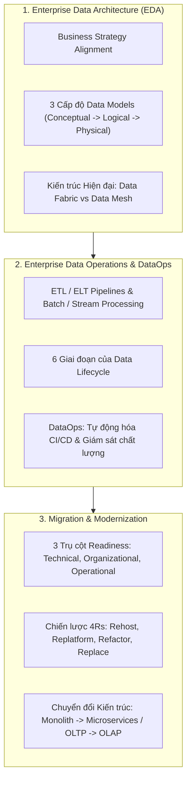
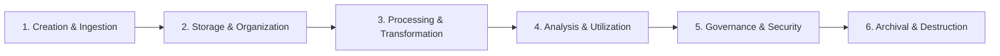

# Enterprise Data Architecture and Operations - Course Wrap-Up

## 1. Tổng quan Khóa học (Course Summary)

Khóa học **Enterprise Data Architecture and Operations** (IBM System Design Specialization - Course 06) trang bị tư duy và kỹ năng thiết kế kiến trúc dữ liệu doanh nghiệp toàn diện từ cấp độ chiến lược (Strategic alignment) đến vận hành thực tế (DataOps, Migration, Modernization).

---

## 2. Các Trụ Cột Kiến Thức Trọng Tâm

### 2.1. Enterprise Data Architecture (EDA)
- **Data Modeling 3 cấp:**
  - *Conceptual Model:* Xác định thực thể kinh doanh (Entities, Business Concepts) không phụ thuộc công nghệ.
  - *Logical Model:* Chuẩn hóa dữ liệu (Attributes, Normalization 3NF, Keys, Relationships).
  - *Physical Model:* Thiết kế tối ưu hóa cho RDBMS/NoSQL (Data Types, Indexing, Partitioning, Storage Engines).
- **Nguyên tắc thiết kế cốt lõi:** Modularity, Interoperability, Scalability, Data Governance, Security & Compliance.
- **Data Fabric vs Data Mesh:**
  - *Data Fabric:* Hướng tiếp cận tích hợp công nghệ, sử dụng Knowledge Graph, AI/Metadata để kết nối dữ liệu phân tán.
  - *Data Mesh:* Hướng tiếp cận hướng domain (Domain-Driven Decentralization), xem dữ liệu như sản phẩm (Data as a Product) do từng Domain Team quản lý.

---

### 2.2. Vòng đời dữ liệu doanh nghiệp (The 6-Stage Data Lifecycle)

| Giai đoạn | Nhiệm vụ chính | Công nghệ / Mẫu kiến trúc áp dụng |
| :--- | :--- | :--- |
| **1. Ingestion** | Thu thập dữ liệu đa nguồn (Batch, Real-time Streaming, CDC). | Apache Kafka, AWS Kinesis, Debezium, Event Hubs. |
| **2. Storage** | Phân tầng lưu trữ theo tần suất truy cập & chi phí. | Data Lake (S3, GCS, ADLS), Lakehouse (Delta Lake, Iceberg). |
| **3. Processing** | Làm sạch, chuẩn hóa, chuyển đổi dữ liệu (ETL / ELT). | Apache Spark, dbt, Apache Flink, Trino. |
| **4. Analysis** | Khai thác BI, OLAP cubes, ML/AI training và Dashboarding. | Snowflake, Google BigQuery, ClickHouse, Redshift. |
| **5. Governance** | Quản lý Metadata, Data Lineage, RBAC, Masking & Compliance. | Apache Atlas, OpenMetadata, Collibra, Great Expectations. |
| **6. Retention/Purge** | Lưu trữ dài hạn (Cold/Glacier) và xóa dữ liệu an toàn. | AWS S3 Glacier Deep Archive, GCS Archive, Auto-retention TTL. |

---

### 2.3. Hiện đại hóa và Di chuyển dữ liệu (Migration & Modernization)

#### A. 3 Trụ Cột Đánh Giá Sẵn Sàng (Readiness Pillars)
1. **Technical Readiness:** Đánh giá cấu trúc Schema, Dependency, Băng thông mạng, Latency, Khối lượng dữ liệu (Data Volume & Velocity).
2. **Organizational Readiness:** Văn hóa dữ liệu, kỹ năng nhân sự (Skill gap), Phê duyệt ngân sách và Quản trị thay đổi (Change management).
3. **Operational Readiness:** Kế hoạch Fallback/Rollback, Giám sát hệ thống (Observability), SLA/SLO, Duy trì tính liên tục (Business Continuity/Zero Downtime).

#### B. Chiến lược 4Rs Migration
- **Rehost (Lift and Shift):** Di chuyển trực tiếp sang Cloud VM/IaaS với ít rủi ro và chi phí ban đầu thấp.
- **Replatform (Lift, Tinker and Shift):** Nâng cấp lên Managed Services (PaaS/Cloud SQL/RDS) mà không thay đổi mã nguồn cốt lõi.
- **Refactor (Re-architect):** Thiết kế lại hoàn toàn sang Cloud-native, chuyển đổi Monolith sang Microservices, RDBMS sang NoSQL hoặc OLTP sang OLAP Star Schema.
- **Replace (Drop and Shop):** Thay thế giải pháp tự xây bằng SaaS hiện đại.

---

## 3. Tổng Hợp Các Lab & Dự Án Thực Hành Đã Hoàn Thành

1. **Lab: Drafting Data Retention Policy (Oil Exploration Company):** Thiết kế chính sách lưu trữ và vòng đời dữ liệu tuân thủ quy định ngành và tối ưu hóa chi phí.
2. **Lab: OLTP to OLAP Schema Transition:** Chuyển đổi dữ liệu chuẩn hóa (3NF) sang Star Schema (Fact & Dimension Tables) phục vụ phân tích BI tốc độ cao.
3. **Lab: RDBMS to NoSQL Document Store Migration:** Tái cấu trúc mô hình dữ liệu quan hệ sang Document Model để tối ưu hóa truy vấn đọc độ trễ thấp.
4. **Final Capstone Project (DigiHealth Healthcare Platform):**
   - Thiết kế ERD hoàn chỉnh cho nền tảng y tế số ([`Part 1_Task 1.pdf`](file:///d:/Ent/Learning/Cousera/IBM%20System%20Design/06.%20Enterprise%20Data%20Architecture%20and%20Operations/Module%203%20-%20Final%20Project%20and%20Final%20Exam/final-assessment/Part%201_Task%201.pdf)).
   - Triển khai MySQL OLTP DDL/DML ([`Part 2_Task1.sql`](file:///d:/Ent/Learning/Cousera/IBM%20System%20Design/06.%20Enterprise%20Data%20Architecture%20and%20Operations/Module%203%20-%20Final%20Project%20and%20Final%20Exam/final-assessment/Part%202_Task1.sql)).
   - Triển khai PostgreSQL OLAP Star Schema DDL/DML ([`Part 2_Task2A.sql`](file:///d:/Ent/Learning/Cousera/IBM%20System%20Design/06.%20Enterprise%20Data%20Architecture%20and%20Operations/Module%203%20-%20Final%20Project%20and%20Final%20Exam/final-assessment/Part%202_Task2A.sql)).
   - Xây dựng Chiến lược Migration, BCP/DR và DataOps toàn diện ([`Part 2_Task 2B.pdf`](file:///d:/Ent/Learning/Cousera/IBM%20System%20Design/06.%20Enterprise%20Data%20Architecture%20and%20Operations/Module%203%20-%20Final%20Project%20and%20Final%20Exam/final-assessment/Part%202_Task%202B.pdf)).
