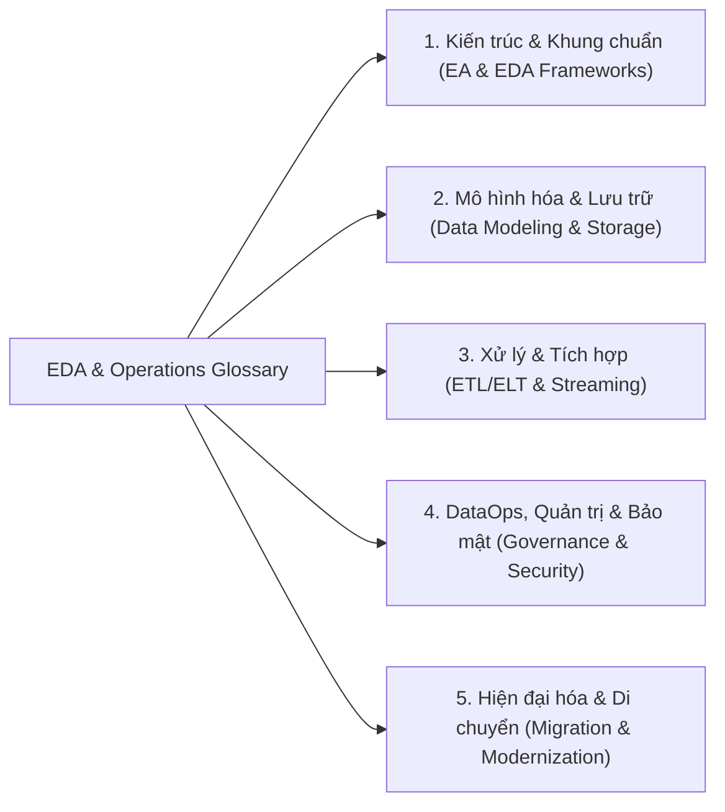

# Thuật Ngữ Kiến Trúc & Vận Hành Dữ Liệu Doanh Nghiệp (EDA & DataOps Glossary)

Tài liệu tra cứu và hệ thống hóa toàn bộ thuật ngữ chuyên ngành trong khóa học **Enterprise Data Architecture and Operations** (IBM System Design Specialization).

---

## 1. Phân Nhóm Thuật Ngữ Theo Chủ Đề Cốt Lõi

---

## 2. Bảng Tra Cứu Thuật Ngữ Chi Tiết (A - Z)

### A
| Thuật ngữ | Định nghĩa tiếng Anh | Giải nghĩa & Ngữ cảnh tiếng Việt |
| :--- | :--- | :--- |
| **Access control** | Mechanisms used to restrict data access based on user roles and permissions. | **Kiểm soát truy cập:** Cơ chế phân quyền và giới hạn truy cập dữ liệu dựa trên vai trò người dùng (RBAC, ABAC). |
| **Advanced analytics** | AI, ML, and predictive analytics that provide deeper insights from data. | **Phân tích nâng cao:** Kỹ thuật khai phá dữ liệu bằng AI/ML để dự báo và tối ưu hóa quyết định kinh doanh. |
| **Aggregations** | Summarizing data through calculations such as sums, averages, and counts. | **Tổng hợp dữ liệu:** Gom nhóm và tính toán (SUM, AVG, COUNT) phục vụ báo cáo BI/OLAP. |
| **Agile methodology** | An iterative approach to development and project management. | **Phương pháp Agile:** Mô hình phát triển lặp, tăng trưởng linh hoạt theo sprint. |
| **AI-driven data cataloging** | Automate organization, tagging, and discovery of data assets using AI. | **Danh mục dữ liệu tự động hóa bằng AI:** Tự động gắn tag, phân loại và lập danh mục metadata. |
| **Amazon S3** | Scalable object storage for data lakes and big data applications. | **Lưu trữ đối tượng Amazon S3:** Dịch vụ Object Storage phổ biến xây dựng Data Lake. |
| **Apache Flink** | Real-time stream processing framework for event-driven analytics. | **Framework Apache Flink:** Công cụ xử lý luồng thời gian thực (stateful stream processing) độ trễ thấp. |
| **Apache Kafka** | Distributed event streaming platform for real-time ingestion. | **Hệ thống Apache Kafka:** Nền tảng phân tán xử lý luồng sự kiện tốc độ cao (Message Broker / Event Streaming). |
| **Apache Spark** | Distributed data processing engine for large-scale batch and stream processing. | **Công cụ Apache Spark:** Engine xử lý dữ liệu phân tán tính toán in-memory quy mô lớn. |
| **API integration** | Enabling connectivity between systems, platforms, and agencies. | **Tích hợp API:** Kết nối trao đổi dữ liệu an toàn giữa các hệ thống và dịch vụ nội bộ/bên ngoài. |
| **Application modernization** | Updating legacy applications with modern frameworks and cloud practices. | **Hiện đại hóa ứng dụng:** Nâng cấp ứng dụng cũ sang kiến trúc Cloud-native / Microservices. |
| **Attributes** | Properties or characteristics of a data entity. | **Thuộc tính:** Các đặc trưng/cột mô tả thực thể (ví dụ: `patient_id`, `doctor_name`). |
| **Audit trails** | Records tracking changes and pipeline activities for regulatory compliance. | **Nhật ký kiểm toán (Audit Trail):** Bản ghi vết toàn bộ thay đổi dữ liệu phục vụ tuân thủ pháp lý. |
| **Automation tools** | Tools such as Ansible, Terraform, Jenkins to automate migration/pipeline tasks. | **Công cụ tự động hóa:** Hạ tầng dạng mã (IaC - Terraform) và CI/CD (Jenkins/GitLab CI). |
| **AWS Glue** | Serverless cloud-based ETL service in AWS ecosystem. | **AWS Glue:** Dịch vụ ETL serverless tự động trích xuất, làm sạch và chuẩn bị dữ liệu. |
| **AWS Kinesis** | Cloud real-time data streaming service for large-scale data feeds. | **AWS Kinesis:** Dịch vụ xử lý luồng dữ liệu thời gian thực trên AWS tương tự Kafka. |

---

### B
| Thuật ngữ | Định nghĩa tiếng Anh | Giải nghĩa & Ngữ cảnh tiếng Việt |
| :--- | :--- | :--- |
| **Batch ingestion** | Periodically collecting and processing large datasets. | **Thu thập dữ liệu theo lô:** Nạp dữ liệu định kỳ theo khung giờ cố định. |
| **Batch processing** | Processing large volumes of data at scheduled intervals. | **Xử lý theo lô (Batch):** Chạy tính toán khối lượng lớn định kỳ (ví dụ: đối soát tài chính cuối ngày). |
| **Business alignment** | Ensuring IT/data objectives align with overall business goals. | **Căn chỉnh mục tiêu kinh doanh & IT:** Đảm bảo kiến trúc dữ liệu phục vụ trực tiếp cho mục tiêu doanh thu/vận hành. |
| **Business intelligence (BI)** | Analyzing data to support decision-making and strategic planning. | **Trí tuệ doanh nghiệp (BI):** Khai thác dữ liệu lịch sử để tạo dashboard báo cáo hỗ trợ ra quyết định. |

---

### C
| Thuật ngữ | Định nghĩa tiếng Anh | Giải nghĩa & Ngữ cảnh tiếng Việt |
| :--- | :--- | :--- |
| **Cardinality** | Numerical relationship between entities (e.g., 1-to-1, 1-to-many, many-to-many). | **Lực lượng quan hệ (Cardinality):** Bản số quan hệ giữa các thực thể trong ERD (1-1, 1-N, N-N). |
| **Change management** | Managing cultural and operational shifts during modernization. | **Quản trị thay đổi:** Chiến lược giúp nhân sự và quy trình thích ứng khi đổi mới công nghệ. |
| **Cloud-native architecture** | Scalable, flexible architecture leveraging cloud storage and compute. | **Kiến trúc Cloud-native:** Kiến trúc tận dụng tối đa Microservices, Containers (Docker/K8s), Serverless. |
| **Cloud-native DataOps** | Implementing DataOps principles using cloud services. | **DataOps trên Cloud:** Tự động hóa CI/CD, kiểm thử và vận hành dữ liệu bằng dịch vụ đám mây. |
| **Collibra** | Data governance tool for cataloging, lineage tracking, and compliance. | **Công cụ Collibra:** Nền tảng quản trị dữ liệu, data catalog và theo dõi nguồn gốc dữ liệu. |
| **Conceptual data model** | High-level representation of business entities and relationships. | **Mô hình dữ liệu khái niệm:** Mô hình cấp cao xác định các thực thể kinh doanh cốt lõi (không phụ thuộc DB). |
| **Continuous Integration/Deployment (CI/CD)** | Automated testing and deployment of data pipelines. | **CI/CD dữ liệu:** Tự động hóa kiểm thử mã nguồn pipeline và triển khai vào production. |

---

### D
| Thuật ngữ | Định nghĩa tiếng Anh | Giải nghĩa & Ngữ cảnh tiếng Việt |
| :--- | :--- | :--- |
| **DAMA-DMBOK** | Framework covering data management disciplines and best practices. | **Khung chuẩn DAMA-DMBOK:** Cẩm nang chuẩn mực quốc tế về quản lý và quản trị dữ liệu. |
| **Data archival** | Moving inactive data to low-cost long-term storage. | **Lưu trữ dữ liệu lịch sử (Archival):** Chuyển dữ liệu ít dùng sang kho lạnh (Cold/Glacier) để tiết kiệm chi phí. |
| **Data cleaning** | Detecting and correcting errors, inconsistencies, and missing values. | **Làm sạch dữ liệu:** Loại bỏ trùng lặp, chuẩn hóa định dạng và xử lý giá trị null. |
| **Data compliance** | Meeting legal and regulatory standards (GDPR, CCPA, HIPAA). | **Tuân thủ dữ liệu:** Đảm bảo lưu trữ và xử lý dữ liệu đáp ứng luật an toàn thông tin (HIPAA, GDPR). |
| **Data democratization** | Enabling non-technical users to access and analyze data securely. | **Dân chủ hóa dữ liệu:** Giúp nhân sự kinh doanh tự phục vụ dữ liệu (Self-service) có kiểm soát. |
| **Data destruction** | Securely deleting obsolete data using methods like cryptographic erasure. | **Hủy dữ liệu an toàn:** Xóa vĩnh viễn dữ liệu hết hạn bằng phương pháp mã hóa/ghi đè không thể khôi phục. |
| **Data fabric** | Unified architecture integrating data across diverse environments via metadata. | **Kiến trúc Data Fabric:** Mạng lưới liên kết dữ liệu đa nguồn dựa trên AI và Metadata tập trung. |
| **Data lake** | Storage system holding raw structured, semi-structured, and unstructured data. | **Hồ dữ liệu (Data Lake):** Nơi lưu trữ dữ liệu thô đa định dạng quy mô lớn. |
| **Data lakehouse** | Hybrid architecture combining Data Lake scale with Data Warehouse query engine. | **Kiến trúc Data Lakehouse:** Kết hợp lưu trữ mở giá rẻ của Data Lake và khả năng ACID/SQL của Data Warehouse. |
| **Data lineage** | Tracking data flow and lifecycle from origin to destination. | **Nguồn gốc dữ liệu (Data Lineage):** Bản đồ truy vết đường đi và biến đổi của dữ liệu qua các pipeline. |
| **Data masking** | Hiding sensitive data while preserving format for test/analytics. | **Mặt nạ dữ liệu (Data Masking):** Che giấu dữ liệu nhạy cảm (PII/thẻ tín dụng) khi dùng cho môi trường UAT/Test. |
| **Data mesh** | Decentralized architecture treating data as a product owned by domain teams. | **Kiến trúc Data Mesh:** Mô hình phi tập trung phân quyền dữ liệu theo từng Domain sản phẩm. |
| **Data migration** | Transferring data between systems while maintaining integrity and uptime. | **Di chuyển dữ liệu:** Quá trình chuyển đổi dữ liệu từ hệ thống cũ sang nền tảng mới an toàn. |
| **DataOps** | Applying DevOps practices (automation, CI/CD, monitoring) to data pipelines. | **Quy trình DataOps:** Ứng dụng tư duy DevOps vào quy trình dữ liệu để tự động hóa và nâng cao chất lượng. |
| **Data retention policy** | Strategy defining data storage duration, archival, and disposal. | **Chính sách lưu giữ dữ liệu:** Quy định thời gian lưu trữ, chuyển kho lạnh và xóa hủy dữ liệu. |
| **Data virtualization** | Querying multiple sources in real time without physical data movement. | **Ảo hóa dữ liệu:** Truy vấn hợp nhất dữ liệu từ nhiều nguồn mà không cần sao chép/di chuyển dữ liệu. |
| **Data warehouse** | Centralized repository optimized for fast querying of structured data. | **Kho dữ liệu (Data Warehouse):** Cơ sở dữ liệu phân tích tập trung tổ chức theo Schema chuẩn (Star/Snowflake). |
| **Denormalization** | Introducing controlled redundancy in physical models to speed up queries. | **Phi chuẩn hóa (Denormalization):** Cố ý thêm dữ liệu dư thừa để giảm phép nối JOIN khi truy vấn OLAP. |

---

### E - L
| Thuật ngữ | Định nghĩa tiếng Anh | Giải nghĩa & Ngữ cảnh tiếng Việt |
| :--- | :--- | :--- |
| **Enterprise Data Architecture (EDA)** | Strategic framework defining how data is collected, stored, and governed. | **Kiến trúc dữ liệu doanh nghiệp:** Khung chiến lược tổng thể định hình hạ tầng dữ liệu của doanh nghiệp. |
| **ETL vs ELT** | Extract-Transform-Load (traditional) vs Extract-Load-Transform (cloud-native). | **Quy trình ETL / ELT:** Chuyển đổi dữ liệu trước khi nạp (ETL) hoặc nạp vào Data Lake trước rồi xử lý (ELT). |
| **Event-driven architecture** | Systems communicating asynchronously using events and message brokers. | **Kiến trúc hướng sự kiện (EDA):** Các microservice giao tiếp bất đồng bộ thông qua Event/Message (Kafka/RabbitMQ). |
| **Foreign key** | A field in a table linking to the Primary Key of another table. | **Khóa ngoại (FK):** Trường thiết lập mối quan hệ ràng buộc toàn vẹn giữa hai bảng. |
| **Google BigQuery** | Serverless cloud data warehouse for fast SQL queries on petabyte scale. | **Google BigQuery:** Kho dữ liệu serverless hiệu năng cao cho phân tích Big Data. |
| **Hybrid cloud** | Integration of on-premises infrastructure with public/private clouds. | **Đám mây lai (Hybrid Cloud):** Kết hợp hạ tầng tại chỗ (On-Prem) với Cloud để tối ưu bảo mật và chi phí. |
| **Identity & Access Management (IAM)** | Framework managing user identities, roles, and resource access. | **Quản lý danh tính và quyền truy cập (IAM):** Hệ thống xác thực và cấp quyền tập trung. |
| **Incremental loading** | Updating only new or modified records instead of full table reload. | **Nạp dữ liệu gia tăng (Incremental Load):** Chỉ đọc và nạp các bản ghi mới hoặc có thay đổi (CDC). |
| **Logical data model** | Technology-independent representation of entities, attributes, and 3NF rules. | **Mô hình dữ liệu logic:** Thiết kế chi tiết cấu trúc dữ liệu, khóa và chuẩn hóa (3NF) độc lập với công nghệ. |

---

### M - P
| Thuật ngữ | Định nghĩa tiếng Anh | Giải nghĩa & Ngữ cảnh tiếng Việt |
| :--- | :--- | :--- |
| **Master Data Management (MDM)** | Single, authoritative source (golden record) of core business entities. | **Quản lý dữ liệu chủ (MDM):** Xây dựng nguồn dữ liệu chuẩn xác duy nhất (Single Source of Truth) cho khách hàng, sản phẩm. |
| **Metadata management** | Administration of data that describes characteristics, context, and lineage. | **Quản lý siêu dữ liệu (Metadata):** Quản lý thông tin mô tả về cấu trúc, ý nghĩa và nguồn gốc của dữ liệu. |
| **Microservices architecture** | Decomposing applications into independent, loosely coupled services. | **Kiến trúc Microservices:** Chia nhỏ hệ thống thành các dịch vụ độc lập, giao tiếp qua API/Event. |
| **Monolithic architecture** | Single-tiered application where all components are tightly coupled. | **Kiến trúc khối (Monolith):** Ứng dụng nguyên khối truyền thống kết hợp toàn bộ logic vào một hệ thống. |
| **Normalization** | Database design technique eliminating redundancy and anomalies (1NF, 2NF, 3NF). | **Chuẩn hóa dữ liệu (Normalization):** Kỹ thuật tổ chức bảng dữ liệu nhằm loại bỏ dư thừa và bất thường dữ liệu. |
| **Observability** | Visibility into pipeline performance, latency, error rates, and data freshness. | **Khả năng quan sát (Observability):** Giám sát toàn diện Metrics, Logs, Traces và Data Quality trong pipeline. |
| **Physical data model** | Concrete DB implementation specifying data types, indexes, and storage. | **Mô hình dữ liệu vật lý:** Thiết kế chi tiết gắn liền với RDBMS/NoSQL cụ thể (Kiểu dữ liệu, Index, Partitions). |
| **Pipeline orchestration** | Scheduling and managing automated data workflows (e.g., Airflow, Prefect). | **Điều phối luồng dữ liệu (Orchestration):** Quản lý lịch chạy, phụ thuộc DAG giữa các tác vụ (Apache Airflow). |
| **Polyglot persistence** | Using different database types (RDBMS, Document, Graph) for different needs. | **Lưu trữ đa mô hình (Polyglot Persistence):** Chọn loại database phù hợp nhất cho từng bài toán (SQL cho giao dịch, NoSQL cho tài liệu). |

---

### R - Z
| Thuật ngữ | Định nghĩa tiếng Anh | Giải nghĩa & Ngữ cảnh tiếng Việt |
| :--- | :--- | :--- |
| **Real-time stream processing** | Processing and analyzing data streams instantly with low latency. | **Xử lý luồng thời gian thực:** Xử lý dữ liệu ngay khi phát sinh (Kafka Streams, Flink). |
| **Refactoring** | Restructuring application/DB code without changing external behavior. | **Tái cấu trúc (Refactor):** Viết lại mã nguồn/schema tối ưu cho kiến trúc Microservices/Cloud-native. |
| **Rehosting (Lift-and-Shift)** | Moving applications/DB to the cloud with minimal code changes. | **Dịch chuyển nguyên trạng (Rehost):** Đưa hệ thống lên Cloud VM mà không sửa đổi logic. |
| **Replatforming** | Moving to cloud with minor optimizations (e.g., adopting Managed RDS). | **Nâng cấp nền tảng (Replatform):** Chuyển sang dịch vụ PaaS/Managed DB mà không đổi toàn bộ kiến trúc. |
| **Role-Based Access Control (RBAC)** | Restricting data and system access based on assigned organizational roles. | **Kiểm soát truy cập theo vai trò (RBAC):** Cấp quyền theo vị trí công việc (ví dụ: Admin, Analyst, Auditor). |
| **Schema (Star vs Snowflake)** | Dimensional data modeling schemas used in Data Warehousing / OLAP. | **Lược đồ Star & Snowflake:** Mô hình bảng Fact (chỉ số) và Dimensions (chiều phân tích) trong OLAP. |
| **Snowflake** | Cloud-native multi-cluster shared-data data warehouse platform. | **Nền tảng Snowflake:** Kho dữ liệu đám mây phân tách độc lập giữa Compute (tính toán) và Storage (lưu trữ). |
| **Technical debt** | Cost of rework caused by choosing quick/easy solutions over robust designs. | **Nợ kỹ thuật (Technical Debt):** Chi phí bảo trì/sửa chữa tích lũy do giải pháp tạm bợ trước đó. |
| **Tiered storage** | Storing data across hot, warm, and cold tiers based on access frequency. | **Lưu trữ phân tầng (Tiered Storage):** Tối ưu chi phí bằng cách phân chia Hot (SSD), Warm (Standard), Cold (Archive). |
| **TOGAF** | The Open Group Architecture Framework for enterprise architecture. | **Khung TOGAF:** Chuẩn mực kiến trúc doanh nghiệp quốc tế phổ biến nhất. |
| **Zachman framework** | 6x6 ontology matrix for enterprise architecture perspectives. | **Khung Zachman:** Ma trận phân loại các góc nhìn kiến trúc (Who, What, Where, When, Why, How). |
| **Zero-trust security model** | Security paradigm requiring strict continuous identity verification. | **Mô hình bảo mật Zero-Trust:** Nguyên tắc không tin cậy bất kỳ ai/thiết bị nào, luôn luôn xác thực và ủy quyền liên tục. |
