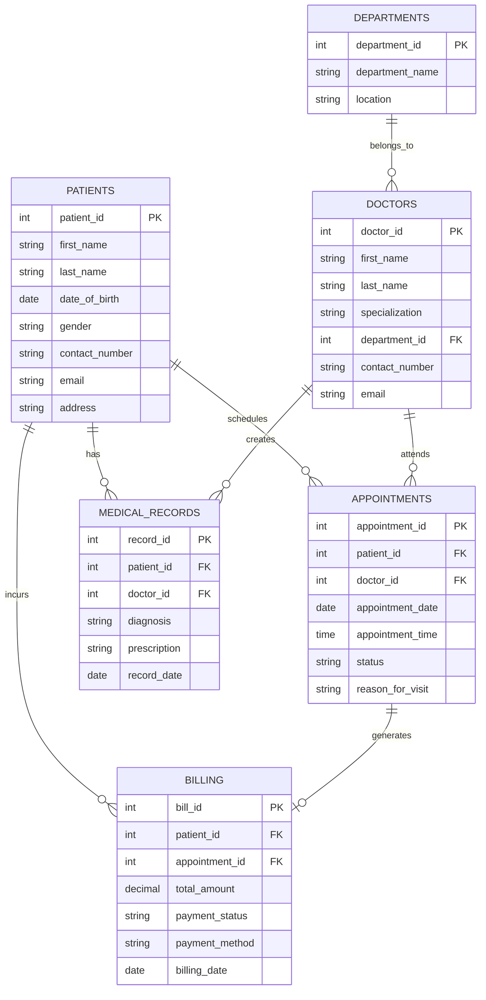

# DigiHealth Inc. - Part 1: Entity-Relationship Diagram (ERD) & 3NF OLTP Schema Design

## 1. Core Entities and Attributes
- **PATIENTS:** `patient_id` (PK), `first_name`, `last_name`, `date_of_birth`, `gender`, `contact_number`, `email`, `address`, `created_at`.
- **DOCTORS:** `doctor_id` (PK), `first_name`, `last_name`, `specialization`, `contact_number`, `email`, `department_id` (FK), `created_at`.
- **DEPARTMENTS:** `department_id` (PK), `department_name`, `location`, `created_at`.
- **APPOINTMENTS:** `appointment_id` (PK), `patient_id` (FK), `doctor_id` (FK), `appointment_date`, `appointment_time`, `status`, `reason_for_visit`, `created_at`.
- **MEDICAL_RECORDS:** `record_id` (PK), `patient_id` (FK), `doctor_id` (FK), `diagnosis`, `prescription`, `treatment_notes`, `record_date`.
- **BILLING:** `bill_id` (PK), `patient_id` (FK), `appointment_id` (FK), `total_amount`, `payment_status`, `payment_method`, `billing_date`.

---

## 2. Normalization Analysis

### First Normal Form (1NF)
- All table columns contain atomic, indivisible values (e.g., patient full names are split into `first_name` and `last_name`).
- Every table has a distinct Primary Key to uniquely identify each record.
- No repeating groups or multi-valued attributes exist within a single row.

### Second Normal Form (2NF)
- The database meets all 1NF requirements.
- Redundant composite-key partial dependencies are eliminated; all non-key attributes are fully functionally dependent on the entire primary key.

### Third Normal Form (3NF)
- The database meets all 2NF requirements.
- Transitive dependencies are eliminated ($X \rightarrow Y$ and $Y \rightarrow Z$).
- For example, doctor department metadata is decoupled into a separate `DEPARTMENTS` table instead of redundantly embedding department details in the `DOCTORS` table.

---

## 3. Entity-Relationship Diagram (ERD - OLTP 3NF)

