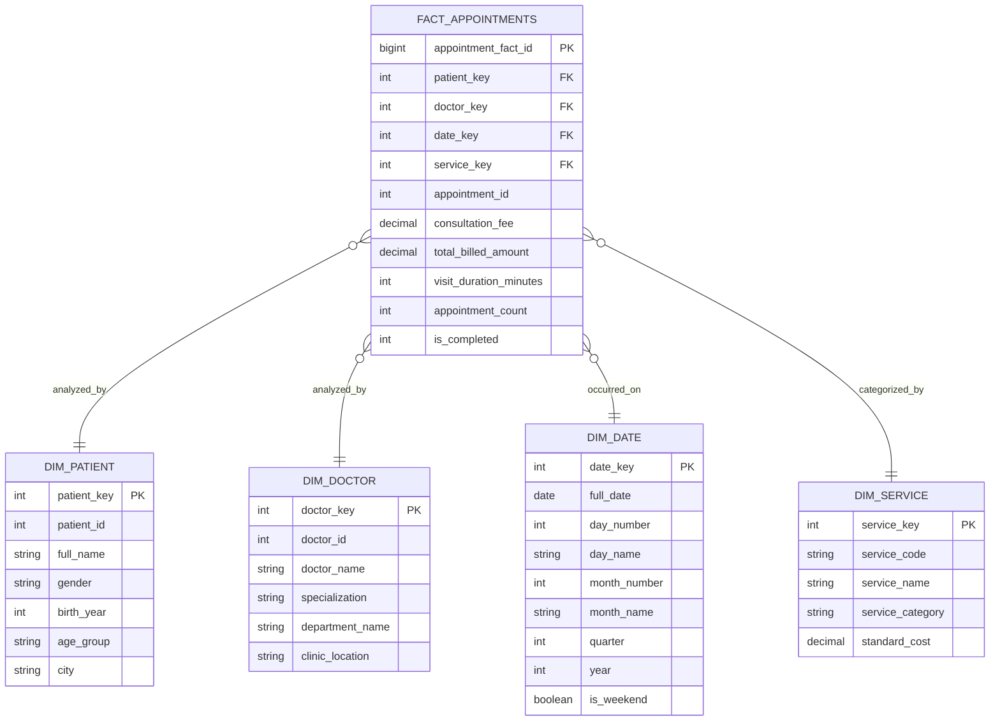
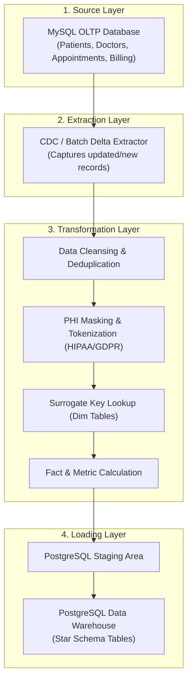

# DigiHealth Inc. - Data Warehouse Implementation Report
**Project:** DigiHealth Modernization Initiative  
**Author:** Enterprise Data Architect  
**Technologies:** PostgreSQL 12+ (OLAP Data Warehouse) & MySQL 8.0+ (OLTP Source)  

---

## 1. Executive Summary
The DigiHealth Enterprise Data Architecture modernization initiative transitions the organization from a siloed operational model to a unified, scalable **OLAP Data Warehouse** architecture.

### Key Objectives:
1. **Eliminate Data Silos:** Consolidate disparate clinical, billing, and administrative records across departments.
2. **Workload Isolation:** Decouple analytical queries from the transactional OLTP engine, eliminating real-time query bottlenecks.
3. **Advanced Healthcare Analytics:** Empower executives and medical staff with multidimensional data models for clinical quality, patient throughput, and revenue cycle management.
4. **Governance & Compliance:** Guarantee strict adherence to **HIPAA** and **GDPR** via Role-Based Access Control (RBAC), data masking, and automated audit trails.

---

## 2. Dimensional Schema Architecture (Star Schema)

### 2.1. Star Schema Justification
A **Star Schema** architecture was selected over a Snowflake Schema due to:
- **Query Performance & Simplicity:** Denormalized dimension tables minimize join complexity, providing sub-second aggregations for BI dashboards (e.g., Power BI, Tableau).
- **Business Intuitiveness:** Simplifies slice-and-dice data exploration for non-technical healthcare analysts.

### 2.2. Dimensional Model Diagram (ERD Data Warehouse)

---

## 3. Fact and Dimension Tables Specification

### 3.1. Dimension Tables
- **`dim_patient`:** Captures patient demographic profiles. Implements surrogate key `patient_key` and tokenizes Protected Health Information (PHI) to comply with HIPAA.
- **`dim_doctor`:** Stores physician attributes, clinical specialties, and department hierarchy.
- **`dim_date`:** Pre-calculated calendar dimensions (`date_key = YYYYMMDD`, day of week, quarter, weekend indicator) enabling rapid time-series analysis without dynamic runtime date functions.
- **`dim_service`:** Standardized catalog of healthcare treatments, diagnostic exams, and pricing structures.

### 3.2. Fact Table (`fact_appointments`)
Stores granular transaction facts for every completed clinical encounter:
- **Foreign Keys:** `patient_key`, `doctor_key`, `date_key`, `service_key`.
- **Degenerate Dimension:** `appointment_id` (links back to operational source system for audits).
- **Additive & Semi-Additive Metrics:**
  - `consultation_fee`: Physician encounter fee.
  - `total_billed_amount`: Aggregate encounter revenue.
  - `visit_duration_minutes`: Operational efficiency and consultation time.
  - `appointment_count`: Atomic counter for patient volume aggregation.

---

## 4. Data Ingestion & ETL Pipeline Architecture

### Transformation Process:
1. **Extract:** Scheduled batch extraction (nightly) or Change Data Capture (CDC) from MySQL binary logs.
2. **Transform:**
   - Cleanses string encodings and standardizes demographic formats.
   - Applies PHI anonymization to sensitive patient fields.
   - Maps operational natural keys (`patient_id`, `doctor_id`) to warehouse surrogate keys.
3. **Load:** Performs idempotent `UPSERT` on slowly changing dimension tables and `APPEND` on partitioned fact tables.

---

## 5. Data Governance, Compliance & Security Strategy
- **Role-Based Access Control (RBAC):** Restricts data access based on operational roles (e.g., Clinical Analysts cannot view unmasked patient identifiers; Financial Analysts cannot view clinical diagnosis details).
- **HIPAA & GDPR Compliance:** Implements transparent data encryption at rest (AES-256) and in transit (TLS 1.3).
- **Audit Logging:** Tracks all data warehouse analytical queries involving patient data to maintain comprehensive auditability.
