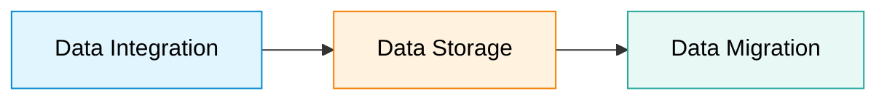

# Course Overview & Prerequisites

## 1. Giới thiệu tổng quan (Course Overview)
Khóa học nằm trong chuỗi **IBM Data Manager Professional Certificate** nhằm trang bị kiến thức và kỹ năng thực hành quản lý dữ liệu toàn diện qua 3 trụ cột:

### Chi tiết 3 trụ cột:
1. **Data Integration (Tích hợp dữ liệu):**
   - Vai trò trong nền kinh tế số hiện đại.
   - Các hình thức trao đổi dữ liệu B2B: chuẩn XML, APIs.
   - Phương pháp Application Integration: **SOAP** & **REST APIs**.
   - Công nghệ Database Integration nâng cao: **Data Warehouses**, **Data Lakes**, **Streaming Data**, **ETL Pipelines**, và **Data Propagation** (Replication,...).
2. **Data Storage (Lưu trữ dữ liệu):**
   - Khái niệm lưu trữ phần cứng/hệ thống: **RAID**, các **Storage Protocols**.
   - Các loại hình và nhà cung cấp Cloud Storage nhằm tối ưu hiệu năng và độ ổn định (resilience).
3. **Data Migration (Di chuyển dữ liệu):**
   - Chiến lược chuyển đổi hệ thống mượt mà, tối thiểu gián đoạn hoạt động kinh doanh (business disruption).
   - Nhận diện rủi ro, thách thức và giải pháp giảm thiểu rủi ro khi migrate.

---

## 2. Mục tiêu khóa học (Course Objectives)
- Giải thích khái niệm và tầm quan trọng của Data Integration trong Data Management hiện đại.
- Nhận diện và phân biệt các kỹ thuật tích hợp dữ liệu khác nhau.
- Mô tả vai trò của Data Storage trong quản lý và truy xuất khối lượng dữ liệu lớn.
- Phân tích quy trình di chuyển dữ liệu (Data Migration) giữa các hệ thống/nền tảng lưu trữ.
- Xác định thách thức, rủi ro phổ biến khi migration và chiến lược khắc phục.

---

## 3. Điều kiện tiên quyết & Khóa học liên quan (Prerequisites)
- **Yêu cầu:** Không bắt buộc bằng cấp chuyên môn; có nền tảng về data management, phân tích dữ liệu, quản lý dự án hoặc cloud storage là một lợi thế.
- **Khóa học tham khảo bổ trợ:**
  - *Course 1:* Introduction to Data Engineering
  - *Course 2:* Excel Basics for Data Analytics
  - *Course 3:* Introduction to Relational Databases
  - *Course 4:* Data Warehouse Fundamentals

---

## 4. Cấu trúc chương trình học (3 Modules)
- **Module 1:** Data Integration (Patterns, Connectors, Security, Tools, Operations).
- **Module 2:** Data Storage (Storage Concepts, Cloud Storage, Backup & Integrity).
- **Module 3:** Data Migration and Final Project (Migration Strategies, Risks, Capstone Project).
