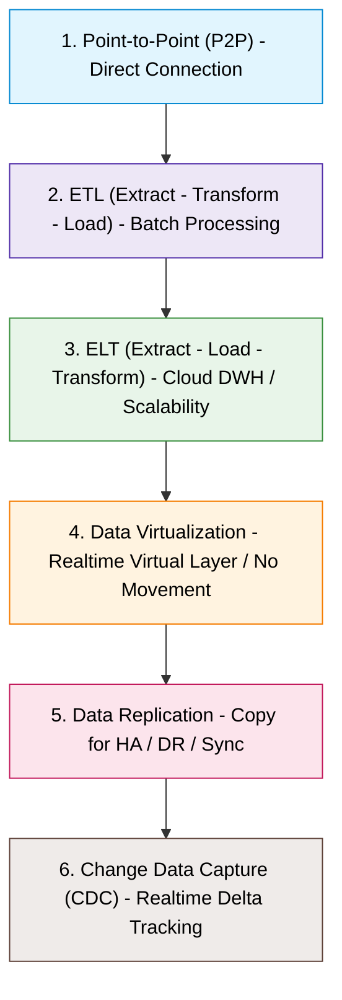

# Introduction to Data Integration and Patterns

## 1. Khái niệm & Mục đích của Data Integration
- **Định nghĩa:** Data Integration (Tích hợp dữ liệu) là quá trình kết hợp dữ liệu từ nhiều nguồn khác nhau nhằm cung cấp một cái nhìn thống nhất, toàn diện (**unified, single coherent view**).
- **Mục đích & Lợi ích:**
  - Phục vụ phân tích dữ liệu (Data Analysis), báo cáo (Reporting) và Business Intelligence (BI).
  - Tối ưu hóa việc ra quyết định (**decision-making**).
  - Nâng cao chất lượng dữ liệu (**data quality**) và giảm trùng lặp (**data redundancy**).
  - Đảm bảo dữ liệu luôn sẵn sàng (**availability**) và dễ dàng truy cập (**accessibility**).

---

## 2. Các thành phần chính trong Data Integration
1. **Data Sources (Nguồn dữ liệu):** Cơ sở dữ liệu (Databases), Flat files (CSV, JSON,...), APIs, hoặc Streaming data.
2. **Integration & Transformation Processes:** Quy trình trích xuất, làm sạch, định dạng để dữ liệu có thể sử dụng được.
3. **Data Storage Systems (Lưu trữ):** Data Warehouses, Data Lakes đóng vai trò lưu trữ tập trung dữ liệu đã tích hợp.
4. **Data Consumers (Đối tượng tiêu thụ):** Các công cụ phân tích, dashboard, BI tools truy xuất dữ liệu từ Data Storage.
5. **Data Integration Tools:** Các công cụ hỗ trợ như IBM DataStage, Talend, Informatica, Apache NiFi.

---

## 3. Sáu mẫu tích hợp dữ liệu phổ biến (6 Data Integration Patterns)

### 1. Point-to-Point Integration (P2P)
- **Cơ chế:** Kết nối trực tiếp giữa từng nguồn (source) và đích (destination).
- **Ưu điểm:** Đơn giản, độ trễ thấp (low latency), thiết lập nhanh.
- **Nhược điểm:** Phức tạp theo cấp số nhân ($O(N^2)$ connections) khi số lượng hệ thống tăng lên, khó bảo trì và mở rộng.
- **Use case:** Môi trường quy mô nhỏ, ít kết nối.

### 2. Extract, Transform, Load (ETL)
- **Cơ chế:** Trích xuất (Extract) $\rightarrow$ Làm sạch/Biến đổi trên server trung gian (Transform) $\rightarrow$ Nạp vào Data Warehouse (Load).
- **Đặc điểm:** Thích hợp xử lý hàng loạt (**batch processing**).
- **Use case:** Dữ liệu không yêu cầu thời gian thực (near real-time / periodic batches).

### 3. Extract, Load, Transform (ELT)
- **Cơ chế:** Trích xuất (Extract) $\rightarrow$ Nạp trực tiếp dữ liệu thô vào đích (Load) $\rightarrow$ Biến đổi trực tiếp bằng tài nguyên tính toán của target (Transform).
- **Đặc điểm:** Tận dụng năng lực xử lý mạnh mẽ và khả năng scale của Cloud Data Warehouses/Data Lakes hiện đại (BigQuery, Snowflake, Redshift).
- **Use case:** Xử lý khối lượng dữ liệu khổng lồ (massive datasets).

### 4. Data Virtualization
- **Cơ chế:** Tạo một lớp dữ liệu ảo (**virtual layer**) trừu tượng hóa, truy vấn trực tiếp vào hệ thống nguồn tại thời gian thực mà **không cần di chuyển hay sao chép vật lý dữ liệu** (no physical data movement).
- **2 bước chính:** Data Access (truy cập thời gian thực) & Data Abstraction (trừu tượng hóa lớp nhìn).
- **Use case:** Cần tích hợp dữ liệu realtime, yêu cầu linh hoạt và tối thiểu việc di chuyển dữ liệu.

### 5. Data Replication
- **Cơ chế:** Tạo bản sao dữ liệu (copy) từ hệ thống này sang hệ thống khác để duy trì tính khả dụng và nhất quán.
- **Use case:** Backup, Disaster Recovery (DR), đồng bộ hóa dữ liệu thời gian thực giữa các hệ thống/vùng.

### 6. Change Data Capture (CDC)
- **Cơ chế:** Theo dõi và chỉ ghi nhận/bắt các thay đổi (**Insert, Update, Delete**) trên nguồn dữ liệu theo thời gian thực, sau đó áp dụng (apply) sang hệ thống đích.
- **Use case:** Đồng bộ hóa dữ liệu realtime cho môi trường có tần suất cập nhật cao, giảm tải băng thông và tải xử lý so với bulk load.
