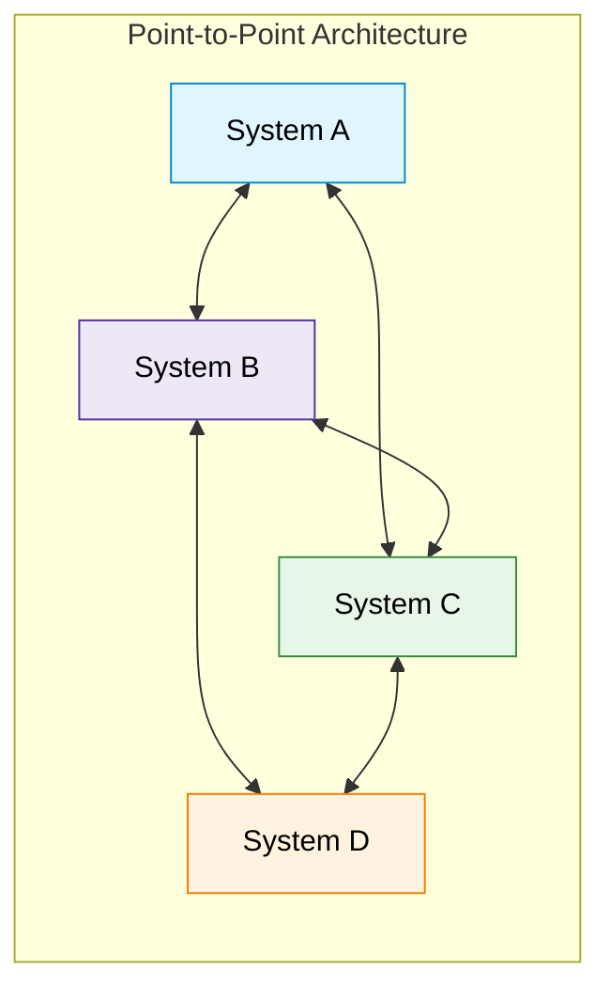

# Point-to-Point Integration Pattern

## 1. Khái niệm & Cơ chế (Overview)
- **Định nghĩa:** Point-to-Point (P2P) Integration là mô hình kết nối trực tiếp giữa từng hệ thống nguồn (Source) và hệ thống đích (Destination) mà không thông qua các lớp trung gian (intermediary layers) hay middleware.
- **Đặc trưng:** Mỗi liên kết được tùy biến riêng biệt theo giao thức và yêu cầu của 2 hệ thống liên quan.

---

## 2. Ưu điểm và Nhược điểm (Trade-offs)

### Ưu điểm (Advantages)
- **Đơn giản (Simplicity):** Cài đặt nhanh, ít yêu cầu hạ tầng phức tạp ban đầu.
- **Độ trễ thấp (Low Latency):** Truyền trực tiếp giữa hai đầu mút giúp trao đổi dữ liệu tức thì (immediate data exchange).
- **Dễ tùy biến (Customization):** Tối ưu hóa định dạng và cơ chế truyền nhận theo đúng yêu cầu cụ thể của 2 hệ thống.
- **Hiệu quả chi phí ban đầu (Cost-Effective):** Không cần đầu tư license hay hạ tầng trung gian đắt tiền khi số lượng hệ thống còn ít.

### Nhược điểm (Disadvantages)
- **Kém mở rộng (Scalability bottleneck):** Số lượng kết nối tăng theo cấp số nhân khi số lượng hệ thống $N$ tăng lên:
  $$\text{Connections} = \frac{N(N-1)}{2}$$
  Dẫn đến hiện tượng mạng nhện phụ thuộc chằng chịt (**spaghetti architecture / web of interdependencies**).
- **Gánh nặng bảo trì (Maintenance Burden):** Mỗi kết nối phải quản lý và update riêng lẻ.
- **Kém linh hoạt (Inflexibility):** Khi một hệ thống thay đổi schema/API, hàng loạt kết nối liên quan phải sửa theo.
- **Rủi ro lỗi cao (High Risk):** Khó phát hiện và xử lý lỗi đồng bộ khi phụ thuộc đa điểm.

---

## 3. Ứng dụng thực tế & Best Practices

### Các trường hợp áp dụng phù hợp (Use Cases)
- **Doanh nghiệp nhỏ (Small Enterprises):** Ít hệ thống, không muốn đầu tư middleware lớn.
- **Yêu cầu Real-time khắt khe:** Financial trading platforms, online gaming systems (cần latency cực thấp).
- **Tích hợp nhanh hệ thống Legacy:** Cầu nối trực tiếp giữa legacy system và hệ thống mới mà không cần đại tu toàn bộ kiến trúc.

### Best Practices khi triển khai P2P
1. **Clear Documentation:** Ghi nhận và lập tài liệu chi tiết cho từng kết nối.
2. **Comprehensive Monitoring:** Triển khai công cụ giám sát sức khỏe từng connection và cảnh báo tự động khi lỗi.
3. **Modular Design:** Thiết kế kết nối dạng module hóa để dễ tái cấu trúc hoặc nâng cấp sau này.

---

## 4. Công cụ hỗ trợ (Integration Tools)

| Công cụ | Đặc điểm chính | Use Case phù hợp |
| :--- | :--- | :--- |
| **Zapier** | Giao diện thân thiện, >2000 apps, prebuilt templates | Tự động hóa tác vụ SaaS, notification, cập nhật bản ghi nhanh |
| **MuleSoft** | API-led connectivity, tài nguyên tái sử dụng, bảo mật cao | Tích hợp cấp Enterprise, quản lý API phức tạp |
| **Boomi (Dell)** | Nền tảng Cloud (iPaaS), drag-and-drop, thư viện connectors lớn | Tích hợp Cloud apps với On-premises systems |
| **Talend** | Open-source, hỗ trợ realtime & Big Data, hybrid cloud | Data migration, synchronization, ETL pipelines |
| **Informatica** | Scalability cao, quản lý dữ liệu toàn diện, AI-driven | Large-scale integration, Data Governance & Data Quality |

---

## 5. Các mô hình thay thế khi mở rộng (Alternative Patterns)
Khi hệ thống phát triển lớn, nên chuyển đổi từ P2P sang:
- **Hub-and-Spoke:** Một Hub trung tâm kết nối đến mọi hệ thống, giảm số lượng đường truyền từ $O(N^2)$ xuống $O(N)$.
- **Enterprise Service Bus (ESB):** Middleware quản lý điều phối, routing và transformation thông điệp linh hoạt.
- **Data Virtualization:** Lớp trừu tượng dữ liệu ảo truy vấn realtime mà không copy dữ liệu.
