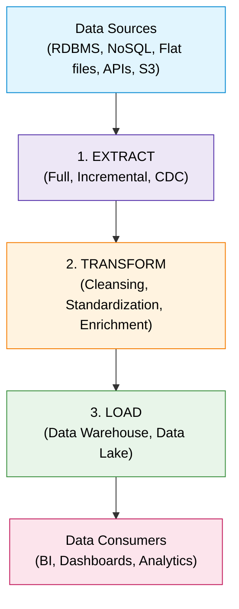
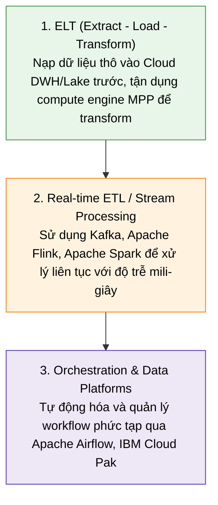

# Extract Transform Load (ETL) Integration Pattern

## 1. Khái niệm cốt lõi (Overview)
- **Định nghĩa:** ETL (Extract, Transform, Load) là quy trình tích hợp dữ liệu thiết yếu cho **Data Warehousing** và **Business Intelligence (BI)**.
- **Mục tiêu:** Thu thập dữ liệu từ nhiều nguồn khác nhau, chuyển đổi sang định dạng chuẩn/sạch, và nạp vào hệ thống lưu trữ tập trung để phục vụ phân tích.

---

## 2. Ba giai đoạn chính của quy trình ETL (3 Primary Phases)

### 1. Extract (Trích xuất)
- **Nguồn trích xuất:** Relational DBs (Oracle, SQL Server), NoSQL (MongoDB), Flat files (CSV, JSON), Cloud Storage (AWS S3), APIs.
- **Phương pháp trích xuất:**
  - **Full Extraction:** Trích xuất toàn bộ dữ liệu từ nguồn.
  - **Incremental Extraction:** Chỉ trích xuất phần dữ liệu thay đổi kể từ lần chạy trước.
  - **Change Data Capture (CDC):** Bắt trực tiếp các sự kiện thay đổi phát sinh từ transaction log của nguồn.

### 2. Transform (Biến đổi)
Đảm bảo chất lượng dữ liệu (**Data Quality**) và tính nhất quán (**Consistency**):
- **Data Cleansing (Làm sạch):** Loại bỏ lỗi, bản ghi trùng lặp (duplicates), xử lý missing values.
- **Data Standardization (Chuẩn hóa):** Định dạng dữ liệu theo quy chuẩn chung (Date format, units, casing, data types).
- **Data Enrichment (Làm giàu):** Bổ sung thông tin ngữ cảnh (dữ liệu nhân khẩu học, tọa độ địa lý, định danh khách hàng).

### 3. Load (Nạp dữ liệu)
Nạp dữ liệu đã xử lý vào hệ thống lưu trữ đích:
- **Data Warehouses (Structured / Analytical Storage):** Amazon Redshift, Google BigQuery, Snowflake, IBM Db2.
- **Data Lakes (Raw / Unstructured / Semi-structured Storage):** Hadoop HDFS, Azure Data Lake Storage (ADLS), AWS S3.

---

## 3. Đánh giá ưu điểm & Thách thức (Benefits & Challenges)

### Ưu điểm (Benefits)
- **Hợp nhất dữ liệu (Data Consolidation):** Tập trung dữ liệu đa nguồn vào một single repository.
- **Chất lượng dữ liệu cao (Enhanced Data Quality):** Dữ liệu được làm sạch và chuẩn hóa trước khi lưu trữ.
- **Lưu trữ lịch sử (Historical Data Storage):** Hỗ trợ phân tích xu hướng và báo cáo theo chuỗi thời gian.
- **Tối ưu hóa hiệu năng truy vấn:** Target storage được tổ chức tối ưu cho các truy vấn phân tích phức tạp.

### Thách thức (Challenges)
- **Độ phức tạp cao:** Thiết kế và duy trì pipeline khi số lượng nguồn và business rules tăng.
- **Độ trễ do Batch-oriented:** ETL truyền thống chạy theo lô định kỳ $\rightarrow$ Dữ liệu không có sẵn ở dạng thời gian thực.
- **Tốn tài nguyên (Resource-intensive):** Yêu cầu CPU/RAM/Storage lớn trên server trung gian để tính toán chuyển đổi.
- **Khó mở rộng (Scalability limits):** Hạ tầng xử lý truyền thống khó scale kịp với khối lượng dữ liệu khổng lồ.

---

## 4. Công cụ & Công nghệ ETL phổ biến

| Công cụ | Đặc điểm nổi bật |
| :--- | :--- |
| **IBM DataStage** | Công cụ mạnh mẽ cho enterprise, thiết kế & thực thi ETL jobs quy mô lớn |
| **Informatica PowerCenter** | Nền tảng toàn diện, khả năng transform mạnh mẽ và độ tin cậy cao |
| **Talend** | Nền tảng mã nguồn mở, giao diện trực quan, kết nối đa dạng |
| **Apache NiFi** | Xử lý dữ liệu luồng (dataflow), ingestion & transformation thời gian thực |
| **Microsoft SSIS** | Tích hợp sâu trong hệ sinh thái Microsoft SQL Server |
| **AWS Glue** | Dịch vụ ETL Cloud Serverless, tự động scale theo nhu cầu |

---

## 5. Xu hướng & Hướng tiếp cận hiện đại (Modern Approaches)

