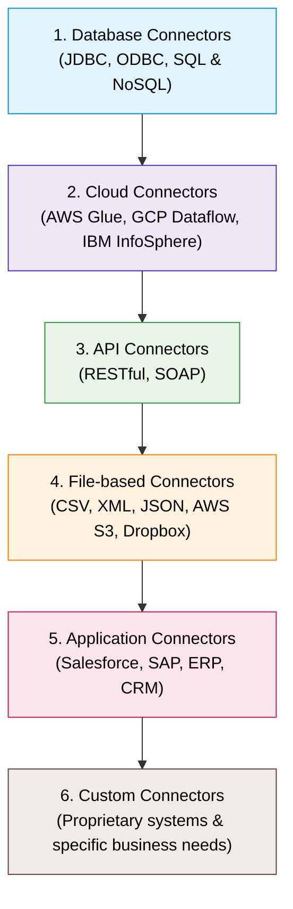
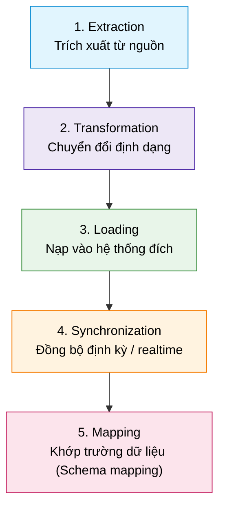

# Introduction to Data Connectors

## 1. Khái niệm cốt lõi (Definition & Role)
- **Định nghĩa:** Data Connectors (Bộ kết nối dữ liệu) là các thành phần phần mềm hoặc công cụ đóng vai trò trung gian hỗ trợ truyền, trích xuất, biến đổi và nạp dữ liệu giữa các hệ thống, ứng dụng khác nhau.
- **Vai trò:** Cầu nối chia sẻ thông tin chính xác, hiệu quả và liền mạch xuyên suốt các nền tảng phân tán.

---

## 2. Phân loại Data Connectors (6 Types)

1. **Database Connectors:** Phổ biến nhất, kết nối các hệ thống cơ sở dữ liệu SQL & NoSQL. Ví dụ: **JDBC** (Java Database Connectivity), **ODBC** (Open Database Connectivity).
2. **Cloud Connectors:** Truyền tải dữ liệu giữa các dịch vụ và ứng dụng nền tảng Cloud. Ví dụ: **AWS Glue**, **Google Cloud Dataflow**, **IBM InfoSphere**.
3. **API Connectors:** Kết nối ứng dụng qua giao diện lập trình ứng dụng tiêu chuẩn. Ví dụ: **RESTful APIs**, **SOAP**.
4. **File-based Connectors:** Quản lý tích hợp dữ liệu qua việc truyền file định dạng CSV, XML, JSON,... Ví dụ: **AWS S3**, **Dropbox**.
5. **Application Connectors:** Tích hợp trực tiếp dữ liệu từ các hệ thống doanh nghiệp lõi (ERP, CRM) như **Salesforce**, **SAP**.
6. **Custom Connectors:** Các bộ kết nối tùy biến được xây dựng riêng cho các hệ thống đặc thù (**proprietary systems**) đáp ứng yêu cầu nghiệp vụ chuyên biệt.

---

## 3. Chức năng chính (Key Functions)

- **Data Extraction:** Trích xuất dữ liệu gốc từ Source system.
- **Data Transformation:** Chuyển đổi dữ liệu sang định dạng tương thích với Target system.
- **Data Loading:** Nạp dữ liệu vào Target system.
- **Data Synchronization:** Đảm bảo dữ liệu nhất quán, cập nhật theo thời gian thực (real-time) hoặc theo lịch trình (scheduled).
- **Data Mapping:** Ánh xạ và căn chỉnh các trường dữ liệu (fields alignment) giữa Source và Target.

---

## 4. Lợi ích (Key Benefits)
- **Tăng hiệu quả (Efficiency):** Tự động hóa quá trình truyền dữ liệu, giảm thiểu can thiệp thủ công.
- **Độ chính xác cao (Accuracy):** Loại bỏ sai sót nhập liệu/xử lý thủ công.
- **Truy cập thời gian thực (Real-time Access):** Cung cấp dữ liệu mới nhất hỗ trợ ra quyết định kịp thời.
- **Khả năng mở rộng (Scalability):** Dễ dàng thêm kết nối mới hoặc nâng cấp hệ sinh thái hiện tại.
- **Tiết kiệm chi phí (Cost Savings):** Giảm chi phí vận hành và nhu cầu tự phát triển custom connector phức tạp từ đầu.
- **Khả năng tương tác (Interoperability):** Tạo cầu nối giao tiếp mượt mà giữa các hệ sinh thái công nghệ khác nhau.

---

## 5. Thách thức & Best Practices khi triển khai

### Thách thức (Challenges)
- **Compatibility (Tương thích):** Khó khăn khi giao tiếp với đa dạng định dạng và hệ thống không đồng nhất.
- **Security & Compliance:** Bảo mật dữ liệu truyền tải và tuân thủ các quy định bảo mật riêng tư (data privacy regulations).
- **Maintenance & Support:** Cần bảo trì, cập nhật liên tục khi các phiên bản nguồn/đích thay đổi.
- **Data Quality:** Đảm bảo tính chính xác và toàn vẹn dữ liệu qua các cơ chế kiểm tra (validation) mạnh mẽ.
- **Scalability Management:** Quản lý số lượng lớn connectors trở nên phức tạp và tốn tài nguyên.

### Best Practices
1. **Lập kế hoạch cẩn thận (Careful Planning):** Xác định rõ ràng nhu cầu, mục tiêu và ràng buộc kỹ thuật trước khi chọn/viết connector.
2. **Chọn Connector phù hợp:** Đảm bảo đáp ứng đầy đủ yêu cầu kỹ thuật và mục tiêu tích hợp.
3. **Ưu tiên bảo mật (Prioritize Security):** Triển khai mã hóa truyền tải, kiểm soát truy cập và tuân thủ quy chuẩn bảo mật.
4. **Giám sát liên tục (Continuous Monitoring):** Theo dõi luồng dữ liệu để phát hiện và xử lý lỗi kịp thời.
5. **Kiến trúc có khả năng mở rộng (Scalable Architecture):** Sử dụng các nền tảng tích hợp có khả năng scale để dễ dàng bổ sung connectors trong tương lai.
