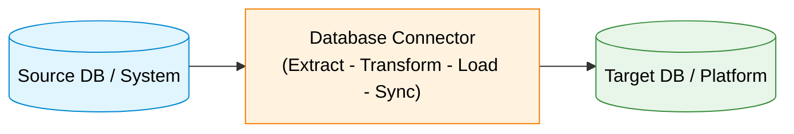
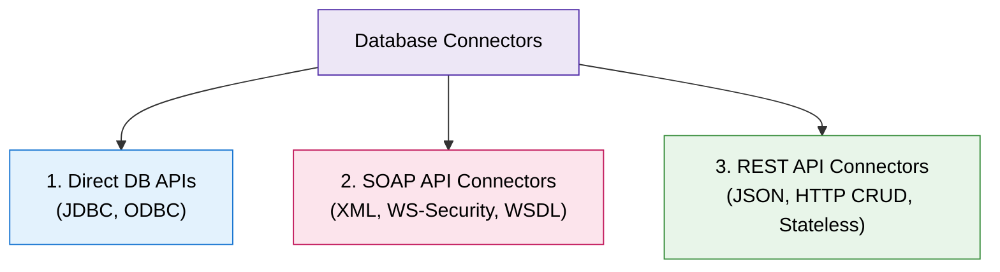

# Database Connectors

## 1. Khái niệm cốt lõi (Definition & Role)
- **Định nghĩa:** Phần mềm trung gian giúp truyền tải, trích xuất, chuyển đổi và đồng bộ dữ liệu giữa các cơ sở dữ liệu và các hệ thống khác nhau.
- **Vai trò:** Đảm bảo trao đổi dữ liệu liền mạch, nâng cao hiệu quả vận hành và khả năng tiếp cận dữ liệu.

---

## 2. 5 Chức năng chính (Key Functions)
- **Extraction:** Trích xuất tập dữ liệu từ database nguồn.
- **Transformation:** Chuyển đổi dữ liệu sang định dạng tương thích với đích.
- **Loading:** Nạp dữ liệu vào database/hệ thống đích.
- **Synchronization:** Duy trì tính nhất quán dữ liệu (real-time hoặc scheduled).
- **Data Mapping:** Khớp và ánh xạ các trường dữ liệu (fields alignment) giữa 2 bên.

---

## 3. Các loại Database Connectors

1. **JDBC & ODBC:**
   - **JDBC:** Chuẩn kết nối cho ứng dụng Java tương tác với RDBMS qua lệnh SQL.
   - **ODBC:** API chuẩn độc lập ngôn ngữ để truy cập nhiều hệ quản trị DBMS khác nhau.
2. **SOAP API Connectors:**
   - Giao thức dựa trên **XML** truyền tải qua HTTP/SMTP; dùng hợp đồng **WSDL**.
   - Bảo mật cao (**WS-Security**), hỗ trợ tốt giao dịch phức tạp (ACID/workflows).
   - *Nhược điểm:* Cồng kềnh, overhead lớn, tiêu tốn tài nguyên.
   - *Ví dụ:* Đồng bộ dữ liệu khách hàng giữa hệ thống ERP và CRM.
3. **REST API Connectors:**
   - Phong cách kiến trúc phi trạng thái (**Stateless**), dùng HTTP methods (`GET`, `POST`, `PUT`, `DELETE`).
   - Hỗ trợ đa dạng định dạng (**JSON**, XML), gọn nhẹ, tốc độ cao, dễ mở rộng (Scalable).
   - *Nhược điểm:* Khó duy trì context giữa các request, hạn chế với transaction phức tạp.
   - *Ví dụ:* Nền tảng E-Commerce lấy danh mục sản phẩm từ Database trung tâm.

---

## 4. So sánh nhanh: SOAP vs. REST

| Tiêu chí | SOAP Connectors | REST Connectors |
| :--- | :--- | :--- |
| **Bản chất** | Giao thức (Protocol) | Phong cách kiến trúc (Architectural Style) |
| **Định dạng dữ liệu** | Chỉ dùng **XML** | Đa dạng (**JSON**, XML, HTML,...) |
| **Hiệu năng & Overhead**| Nặng, tốn băng thông/CPU | Gọn nhẹ, nhanh, tối ưu cache |
| **Quản lý trạng thái** | Stateful hoặc Stateless | Hoàn toàn **Stateless** |
| **Bảo mật** | **WS-Security** cấp thông điệp | **HTTPS/TLS**, OAuth 2.0, JWT |
| **Ứng dụng tối ưu** | Tích hợp ERP/CRM, ngân hàng, giao dịch phức tạp | Web/Mobile apps, Microservices, CRUD APIs |

---

## 5. Lợi ích & Thách thức

### Lợi ích (Benefits)
- **Tự động hóa & Chính xác:** Giảm can thiệp thủ công, loại bỏ sai sót nhập liệu.
- **Dữ liệu Real-time:** Truy cập tức thời phục vụ ra quyết định kinh doanh.
- **Khả năng mở rộng & Tiết kiệm chi phí:** Dễ tích hợp thêm nguồn mới, tối ưu chi phí vận hành.

### Thách thức (Key Challenges)
- **Compatibility:** Tương thích giữa các hệ quản trị database và định dạng dữ liệu không đồng nhất.
- **Security & Compliance:** Mã hóa đường truyền và tuân thủ các chuẩn an toàn dữ liệu.
- **Maintenance & Monitoring:** Giám sát liên tục và cập nhật driver/connector định kỳ.
- **Data Quality:** Bảo toàn tính toàn vẹn và chất lượng dữ liệu khi chuyển đổi.
