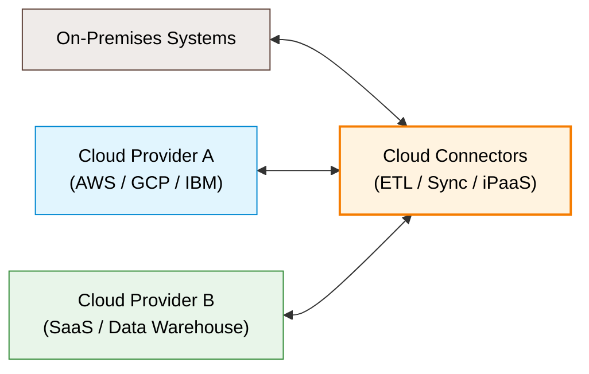
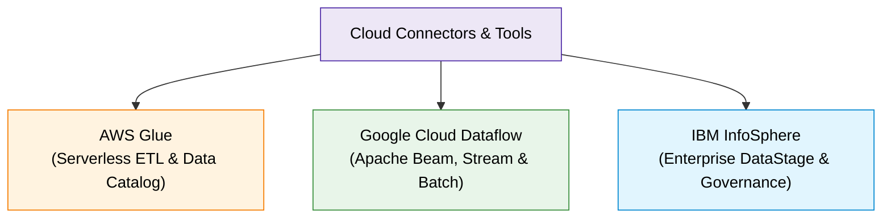

# Cloud Connectors for Data Integration

## 1. Khái niệm cốt lõi (Core Concepts)
- **Định nghĩa:** **Cloud Connectors** là công cụ chuyên biệt hỗ trợ tích hợp dữ liệu giữa các môi trường Cloud khác nhau hoặc giữa Cloud và On-premises.
- **Vai trò:** 
  - Thực hiện quy trình **ETL** (Extract, Transform, Load) và đồng bộ dữ liệu.
  - Duy trì tính toàn vẹn (data integrity) và sẵn sàng của dữ liệu trong mô hình **Multi-cloud** / **Hybrid Cloud**.
  - Có thể hoạt động độc lập hoặc là một thành phần trong nền tảng **iPaaS** (Integration Platform as a Service).

---

## 2. Top 3 Công cụ Cloud Connectors tiêu biểu

### 2.1. AWS Glue (Amazon Web Services)
- **Đặc trưng:** Dịch vụ **Serverless ETL** hoàn toàn được quản lý (fully managed) trong hệ sinh thái AWS.
- **Tính năng nổi bật:**
  - **AWS Glue Data Catalog:** Tự động khám phá (discover) và lập chỉ mục metadata từ Amazon S3, RDS, Redshift.
  - Hỗ trợ tạo job ETL qua giao diện trực quan (Visual UI) hoặc code bằng Python/Scala.
  - Tự động co giãn tài nguyên (Auto-scaling) theo nhu cầu xử lý.
- **Use case thực tế:** Ngành y tế tích hợp dữ liệu bệnh nhân (S3), thanh toán (RDS) và phân tích (Redshift) để phân tích tập trung.

---

### 2.2. Google Cloud Dataflow (Google Cloud Platform)
- **Đặc trưng:** Nền tảng xử lý dữ liệu lớn theo thời gian thực (**Real-time**) và theo lô (**Batch**) dựa trên mã nguồn mở **Apache Beam**.
- **Tính năng nổi bật:**
  - Mô hình lập trình hợp nhất cho cả luồng streaming và xử lý batch.
  - Tích hợp sâu với BigQuery, Google Cloud Storage (GCS), Pub/Sub.
  - Tự động phân bổ và tối ưu hóa tài nguyên (Auto-managed resources).
- **Use case thực tế:** Bán lẻ (Retail) thu thập dữ liệu realtime từ POS, website và chuỗi cung ứng để điều chỉnh giá động (dynamic pricing), phát hiện gian lận và gợi ý sản phẩm cá nhân hóa.

---

### 2.3. IBM InfoSphere (IBM)
- **Đặc trưng:** Bộ công cụ cấp doanh nghiệp (**Enterprise-level**) tập trung vào tích hợp, quản trị (**Governance**) và chất lượng dữ liệu (**Data Quality**).
- **Tính năng nổi bật:**
  - **InfoSphere DataStage:** Xử lý các quy trình ETL quy mô lớn với hiệu năng cao.
  - **InfoSphere Information Server:** Đảm bảo quản trị dữ liệu chặt chẽ và tuân thủ quy chuẩn pháp lý.
  - Khả năng kết nối mạnh mẽ với các môi trường không đồng nhất (On-premises, Cloud, Hadoop Big Data).
- **Use case thực tế:** Ngân hàng đa quốc gia tích hợp dữ liệu CRM, giao dịch core banking và đánh giá rủi ro nhằm đảm bảo tuân thủ quy định tài chính nghiêm ngặt.

---

## 3. Bảng so sánh tổng hợp

| Tiêu chí | AWS Glue | Google Cloud Dataflow | IBM InfoSphere |
| :--- | :--- | :--- | :--- |
| **Mục đích chính** | Serverless ETL & Quản lý Catalog | Xử lý Stream & Batch thời gian thực | Tích hợp dữ liệu lớn & Quản trị doanh nghiệp |
| **Nền tảng / Công nghệ** | AWS Native, Python / Scala | Apache Beam Engine | DataStage, Information Server |
| **Điểm mạnh nổi bật** | Tự động lập metadata catalog, không cần quản lý hạ tầng | Xử lý streaming độ trễ thấp, auto-scale linh hoạt | Quản trị dữ liệu (Governance), kiểm soát chất lượng & tuân thủ cao |
| **Đối tượng phù hợp nhất** | Doanh nghiệp dùng hệ sinh thái AWS cần ETL mở rộng | Hệ thống cần phân tích dữ liệu real-time / streaming trên GCP | Doanh nghiệp lớn với môi trường phức tạp (Heterogeneous/Hybrid) |

---

## 4. Tóm tắt nhanh (Key Takeaways)

> [!TIP]
> - **Cloud Connectors** là nhân tố cốt lõi để kết nối luồng dữ liệu giữa các đám mây và hệ thống On-premise.
> - **AWS Glue:** Lựa chọn hàng đầu cho **Serverless ETL** trong hệ sinh thái AWS.
> - **Google Cloud Dataflow:** Lựa chọn tối ưu cho **Streaming & Real-time analytics** với Apache Beam.
> - **IBM InfoSphere:** Chuẩn mực cho **Doanh nghiệp lớn** đòi hỏi kiểm soát **Data Governance & Compliance** khắt khe.
