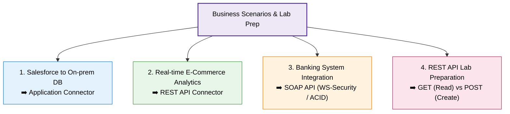

# Dialogue: Data Connectors in Action

## 1. Tổng quan phiên thảo luận (Overview)
- **Mục tiêu:** Vận dụng lý thuyết về các loại **Data Connectors** và **API Integration (REST vs. SOAP)** vào các tình huống thực tế; chuẩn bị kiến thức phương thức HTTP cho bài thực hành (Hands-on Lab).
- **Trọng tâm chính:**
  1. Lựa chọn Connector phù hợp theo tình huống nghiệp vụ.
  2. Quyết định sử dụng REST hay SOAP dựa trên yêu cầu bảo mật và giao dịch.
  3. Phương thức HTTP (`GET` vs. `POST`) trong tích hợp REST API.

---

## 2. Các tình huống thực tế & Lựa chọn giải pháp (Q&A Keypoints)

### Tình huống 1: Đồng bộ dữ liệu Salesforce với On-premises SQL Database
- **Lựa chọn:** **Application Connector**.
- **Lý do (Keypoint):** Salesforce là ứng dụng SaaS/CRM doanh nghiệp lõi. Application Connector cung cấp các adapter và schema mapping dựng sẵn (pre-built), giúp tự động hóa việc kết nối và trích xuất dữ liệu mà không cần viết custom code phức tạp.

---

### Tình huống 2: Lấy dữ liệu bán hàng Real-time từ E-commerce lên Dashboard Phân tích
- **Lựa chọn:** **API Connector** (REST API Connector).
- **Lý do (Keypoint):** REST API hỗ trợ các HTTP request gọn nhẹ, phản hồi nhanh dưới dạng **JSON** với độ trễ tối thiểu, rất tối ưu cho luồng dữ liệu thời gian thực (so với các kết nối dạng File-based chạy theo lô/batch).

---

### Tình huống 3: Hệ thống Ngân hàng đòi hỏi Bảo mật cao & Giao dịch phức tạp
- **Lựa chọn:** **SOAP API**.
- **Lý do (Keypoint):** SOAP hỗ trợ các tiêu chuẩn bảo mật doanh nghiệp nghiêm ngặt (**WS-Security**) ở cấp độ thông điệp, hợp đồng dịch vụ chuẩn hóa (**WSDL**), cùng khả năng đảm bảo tính toàn vẹn cho các giao dịch ACID nhiều bước (stateful multi-step workflows).

---

### Tình huống 4: Chuẩn bị thực hành REST API (`GET` vs. `POST`)
- **Truy xuất danh sách sản phẩm (Retrieve data):**
  - Sử dụng **`HTTP GET`**.
  - *Bản chất:* Phương thức an toàn (Safe & Idempotent), chỉ đọc/lấy dữ liệu từ server mà không làm thay đổi trạng thái hệ thống, trả về payload kèm mã `200 OK`.
- **Thêm mới sản phẩm vào cơ sở dữ liệu (Create resource):**
  - Sử dụng **`HTTP POST`**.
  - *Bản chất:* Đóng gói thông tin sản phẩm mới vào **Request Body** (JSON) để tạo mới tài nguyên và ghi vào cơ sở dữ liệu, làm thay đổi trạng thái server, thường trả về mã `201 Created`.

---

## 3. Bảng tổng kết nhanh

| Nghiệp vụ / Yêu cầu | Giải pháp tối ưu | Lý do cốt lõi |
| :--- | :--- | :--- |
| **SaaS / CRM (Salesforce) ↔ On-premise** | **Application Connector** | Có sẵn adapter chuyên biệt & schema mapping |
| **Real-time Data Dashboard** | **REST API Connector** | Gọn nhẹ, JSON payload, độ trễ thấp |
| **Banking / Multi-step ACID Transactions** | **SOAP API** | Chuẩn WS-Security, WSDL, kiểm soát giao dịch chặt chẽ |
| **Đọc dữ liệu từ REST API** | **HTTP GET** | Read-only, safe, không đổi trạng thái server |
| **Tạo mới bản ghi qua REST API** | **HTTP POST** | Gửi data trong request body, tạo tài nguyên trên server |

---

## 4. Lưu ý cho bài thực hành (Hands-on Lab Notes)
- Khi tích hợp REST API với các công cụ BI (như **Power BI**):
  - Chú ý cấu hình phương thức xác thực (**Authentication**) phù hợp.
  - Nắm vững cách parse và chuyển đổi cấu trúc phân cấp dữ liệu từ định dạng **JSON response** thành bảng phẳng để trực quan hóa.
