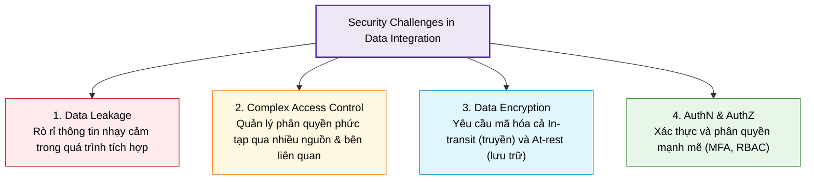
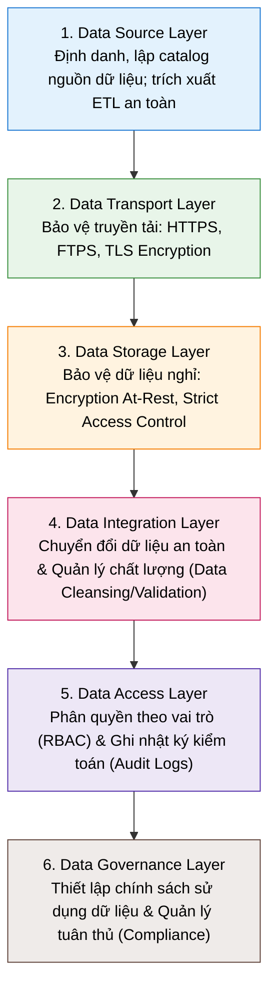

# Security and Technical Architecture

## 1. Khái niệm & Tầm quan trọng của Bảo mật Tích hợp Dữ liệu

- **Định nghĩa:** **Data Integration** là quá trình kết hợp dữ liệu từ nhiều nguồn phân tán (bán hàng, phản hồi khách hàng, kho bãi...) để tạo ra một góc nhìn thống nhất (**unified view**).
- **Tầm quan trọng của bảo mật:**
  - **Bảo vệ dữ liệu nhạy cảm:** Ngăn chặn truy cập trái phép vào dữ liệu mật.
  - **Tuân thủ pháp lý:** Đáp ứng các quy định nghiêm ngặt như **GDPR**, **HIPAA**.
  - **Ngăn ngừa vi phạm dữ liệu (Data Breaches):** Tránh thiệt hại tài chính và tổn hại uy tín thương hiệu.
  - **Đảm bảo tính toàn vẹn (Data Integrity):** Giữ cho dữ liệu luôn chính xác và nhất quán.

---

## 2. Các thách thức bảo mật cốt lõi (Security Challenges)

---

## 3. 6 Tầng Kiến trúc Kỹ thuật (6 Layers of Technical Architecture)

### Chi tiết 6 tầng:
1. **Data Source Layer (Tầng Nguồn):** Nhận diện, lập danh mục (cataloging) toàn bộ nguồn dữ liệu và trích xuất an toàn qua công cụ ETL.
2. **Data Transport Layer (Tầng Truyền tải):** Bảo vệ dữ liệu trên đường truyền bằng các giao thức bảo mật (**HTTPS**, **FTPS**) và công nghệ mã hóa **TLS**.
3. **Data Storage Layer (Tầng Lưu trữ):** Áp dụng thuật toán mã hóa dữ liệu nghỉ (**Data at Rest**) và kiểm soát truy cập nghiêm ngặt.
4. **Data Integration Layer (Tầng Tích hợp):** Chuyển đổi dữ liệu sang format thống nhất an toàn (không để lộ dữ liệu nhạy cảm) và quản lý chất lượng dữ liệu (**Data Quality**: validation, cleansing).
5. **Data Access Layer (Tầng Truy cập):** Áp dụng **RBAC** (Role-Based Access Control) để cấp quyền chính xác theo vai trò và duy trì **Audit Logs** chi tiết mọi hoạt động truy cập.
6. **Data Governance Layer (Tầng Quản trị):** Ban hành và thực thi chính sách bảo mật dữ liệu, giám sát tuân thủ các quy định và tiêu chuẩn ngành.

---

## 4. Best Practices bảo mật tích hợp dữ liệu

| Best Practice | Mục đích & Triển khai |
| :--- | :--- |
| **Advanced Encryption** | Mã hóa toàn diện dữ liệu cả **In-transit** (khi truyền tải) và **At-rest** (khi lưu trữ). |
| **Auditing & Monitoring** | Thực hiện kiểm toán bảo mật định kỳ và giám sát luồng tích hợp liên tục để phát hiện sớm lỗ hổng. |
| **MFA & RBAC** | Áp dụng xác thực đa yếu tố (**MFA**) và phân quyền theo vai trò (**RBAC**) để siết chặt quyền truy cập. |
| **Data Masking** | Che giấu/ẩn thông tin nhạy cảm trong quá trình tích hợp và thử nghiệm. |
| **API Security** | Bảo vệ các API tích hợp bằng xác thực token, rate limiting và mã hóa. |
| **Employee Training** | Nâng cao nhận thức và đào tạo nhân viên về an toàn bảo mật dữ liệu. |

---

## 5. Tóm tắt nhanh (Key Takeaways)

> [!TIP]
> - Bảo mật trong tích hợp dữ liệu là yếu tố sống còn để ngăn ngừa rò rỉ dữ liệu và tuân thủ pháp luật (**GDPR/HIPAA**).
> - Kiến trúc bảo mật gồm **6 tầng**: *Source ➔ Transport ➔ Storage ➔ Integration ➔ Access ➔ Governance*.
> - Nguyên tắc phòng thủ toàn diện: Kết hợp **Mã hóa (In-transit/At-rest)**, **MFA/RBAC**, **Data Masking**, **API Security** và **Audit Logs**.
