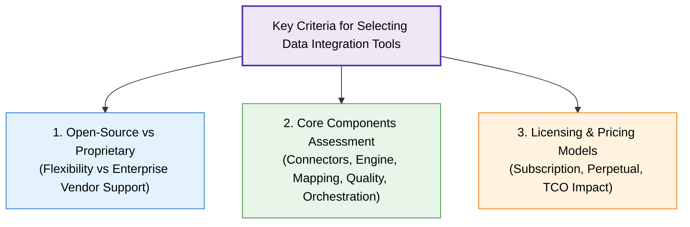
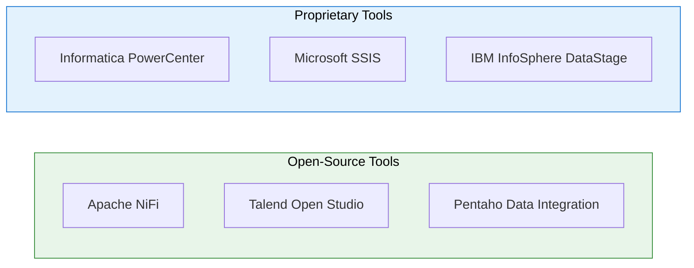
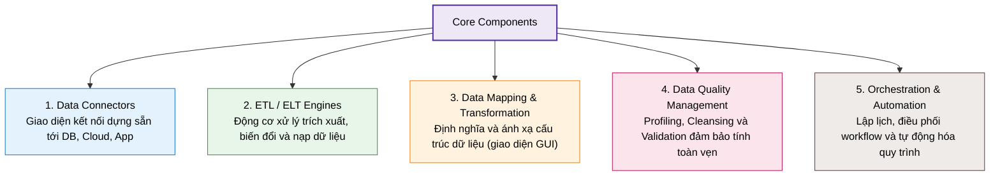

# Overview of Data Integration Tools

## 1. Tổng quan & Tiêu chí lựa chọn (Overview & Selection Criteria)

- **Vai trò:** Data Integration Tools hợp nhất các nguồn dữ liệu phân tán (databases, applications, cloud platforms) vào một kho tập trung duy nhất (**single repository**).
- **3 Tiêu chí quyết định khi chọn công cụ:**
  1. Lựa chọn giữa giải pháp **Open-source** (Mã nguồn mở) hay **Proprietary** (Thương mại).
  2. Đánh giá **5 thành phần cốt lõi** của công cụ.
  3. Phân tích mô hình **cấp phép & chi phí sở hữu** (**TCO** - Total Cost of Ownership).

---

## 2. So sánh Open-Source vs. Proprietary Tools

| Tiêu chí | Open-Source Tools | Proprietary Tools |
| :--- | :--- | :--- |
| **Định nghĩa** | Phần mềm mã nguồn mở tự do truy cập, chỉnh sửa | Phần mềm thương mại đóng gói do vendor phát triển và bán bản quyền |
| **Ví dụ tiêu biểu** | **Apache NiFi**, **Talend Open Studio**, **Pentaho** | **Informatica PowerCenter**, **Microsoft SSIS**, **IBM InfoSphere DataStage** |
| **Ưu điểm** | - Tiết kiệm chi phí bản quyền ban đầu - Tự do tùy biến mã nguồn theo nhu cầu - Cộng đồng người dùng năng động | - Hỗ trợ kỹ thuật toàn diện 24/7 từ hãng - Tính năng nâng cao (real-time, enterprise security) - Giao diện trực quan, nhiều pre-built connectors |
| **Nhược điểm** | - Đòi hỏi năng lực kỹ thuật nội bộ cao - Hỗ trợ cộng đồng không cam kết SLA - Tài liệu có thể thiếu hoặc lỗi thời | - Chi phí đầu tư & duy trì đắt đỏ - Ràng buộc bản quyền và nguy cơ Vendor lock-in |
| **Phù hợp với** | Startups, doanh nghiệp nhỏ, đội ngũ kỹ thuật mạnh | Doanh nghiệp lớn, môi trường dữ liệu phức tạp cần SLA cao |

---

## 3. 5 Thành phần cốt lõi của Data Integration Tool (Core Components)

1. **Data Connectors:** Bộ adapter dựng sẵn kết nối đa dạng nguồn dữ liệu (RDBMS, NoSQL, Cloud, SaaS).
2. **ETL / ELT Engines:** Trái tim xử lý trích xuất, biến đổi và nạp dữ liệu vào Data Warehouse/Data Lake.
3. **Data Mapping & Transformation:** Công cụ ánh xạ schema giữa nguồn và đích, thường tích hợp giao diện kéo thả (GUI).
4. **Data Quality Management:** Các tiện ích rà soát (**profiling**), làm sạch (**cleansing**) và xác thực (**validation**) dữ liệu.
5. **Orchestration & Automation:** Cơ chế lập lịch (scheduling), quản lý luồng phụ thuộc và tự động hóa pipeline để giảm thiểu thao tác thủ công.

---

## 4. Mô hình Cấp phép & Định giá (Licensing & Pricing Models)

- **Open-source Licensing:** 
  - Hoạt động dưới các giấy phép như **Apache**, **GPL**, **MIT**.
  - Không tốn phí bản quyền; chi phí chủ yếu đến từ **nhân sự kỹ thuật** vận hành và bảo trì.
- **Proprietary Licensing:**
  - **Subscription Model (Đăng ký định kỳ):** Trả phí hàng tháng/hàng năm dựa trên số lượng người dùng (users), khối lượng dữ liệu (data volume) hoặc năng lực tính toán (processing capacity/cores).
  - **Perpetual Model (Bản quyền vĩnh viễn):** Trả phí mua bản quyền một lần, kèm theo phí bảo trì và hỗ trợ (maintenance & support fee) định kỳ hàng năm.

---

## 5. Tóm tắt nhanh (Key Takeaways)

> [!TIP]
> - **Open-Source** (NiFi, Talend, Pentaho): Linh hoạt, chi phí bản quyền thấp nhưng đòi hỏi kỹ năng in-house cao.
> - **Proprietary** (Informatica, SSIS, DataStage): Chi phí cao nhưng sở hữu hỗ trợ chuyên nghiệp từ vendor, tính năng doanh nghiệp hoàn thiện và giao diện thân thiện.
> - **5 Trụ cột của công cụ:** *Connectors, ETL/ELT Engine, Mapping, Data Quality, Orchestration*.
> - **Định giá:** Cần tính toán tổng chi phí sở hữu (**TCO**) gồm phí bản quyền (Subscription/Perpetual) và chi phí vận hành/nhân sự.
