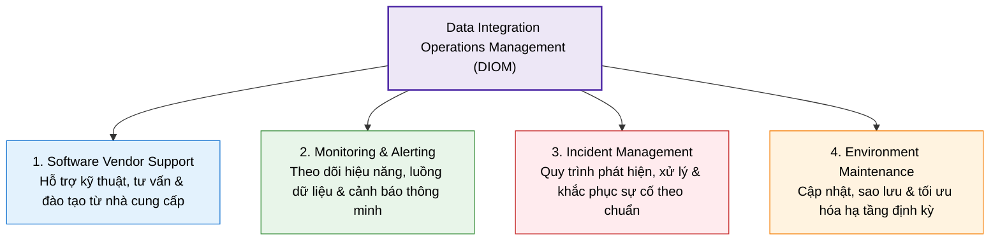
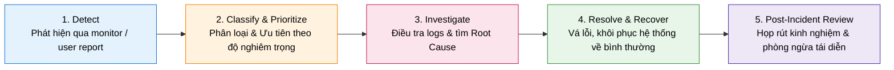

# Data Integration Operations Management (DIOM)

## 1. Khái niệm cốt lõi (Core Concepts)
- **Định nghĩa:** **DIOM** (Quản lý Vận hành Tích hợp Dữ liệu) là tập hợp các quy trình và công cụ nhằm tích hợp, quản trị và đảm bảo tính sẵn sàng (**availability**) của dữ liệu từ nhiều nguồn phân tán phục vụ việc ra quyết định.
- **Mục tiêu:** Giữ cho toàn bộ hạ tầng và pipeline dữ liệu hoạt động ổn định, hiệu năng cao, giảm thiểu gián đoạn (downtime).

---

## 2. 4 Yếu tố cốt lõi của DIOM (4 Key Elements)

### 2.1. Software Vendor Support (Hỗ trợ từ Vendor)
- **3 Loại hình hỗ trợ:**
  - **Technical Support:** Cài đặt, cấu hình, xử lý sự cố kỹ thuật và khắc phục lỗi qua help desk/tài liệu.
  - **Consultative Support:** Tư vấn tối ưu hóa chiến lược tích hợp và áp dụng best practices.
  - **Training & Education:** Đào tạo kỹ năng nội bộ qua webinar, workshop và chương trình chứng chỉ.
- **Best Practices:**
  - Thiết lập cam kết dịch vụ (**SLA**) rõ ràng về phạm vi và thời gian phản hồi.
  - Xây dựng mối quan hệ đối tác tin cậy để xử lý sự cố nhanh chóng.
  - Định kỳ đánh giá lại chất lượng dịch vụ hỗ trợ của vendor.

---

### 2.2. Monitoring & Alerting (Giám sát & Cảnh báo)
- **Các chỉ số giám sát cốt lõi (Key Metrics):**
  - **System Performance:** Theo dõi tải CPU, RAM, băng thông mạng (Network Bandwidth).
  - **Data Flow Monitoring:** Giám sát lưu lượng pipeline, phát hiện điểm nghẽn (bottlenecks), độ trễ hoặc lỗi trong quy trình ETL.
  - **Error Tracking:** Bắt log lỗi sai lệch dữ liệu (data mismatches), lỗi biến đổi (failed transformations), mất kết nối.
- **Cơ chế Cảnh báo (Alerting):** Tự động gửi cảnh báo (Email/SMS/Ticket) khi vi phạm ngưỡng (thresholds) hoặc tự động kích hoạt xử lý (Restart tiến trình lỗi, phân bổ lại tài nguyên).
- **Best Practices:**
  - Thiết lập ngưỡng hợp lý để tránh hiện tượng **Alert Fatigue** (quá nhiều cảnh báo gây ngợp và bỏ sót lỗi nghiêm trọng).
  - Thiết kế **Real-time Dashboards** trực quan hóa trạng thái sức khỏe toàn hệ thống.
  - Định kỳ tinh chỉnh lại các quy tắc cảnh báo khi dữ liệu tăng trưởng.

---

### 2.3. Incident Management (Quản lý Sự cố)
Quy trình 5 bước xử lý sự cố chuẩn mực:

- **Best Practices:**
  - Định rõ vai trò, trách nhiệm và quy trình leo thang (**Escalation Paths**).
  - Ghi nhật ký chi tiết (**Detailed Incident Records**) để làm giàu tri thức xử lý lỗi.
  - Định kỳ tổ chức diễn tập giả lập sự cố (**Drills & Simulations**) cho đội ngũ ứng phó.

---

### 2.4. Environment Maintenance (Bảo trì Môi trường)
- **3 Hoạt động then chốt:**
  - **Software Updates & Patching:** Áp dụng kịp thời bản vá bảo mật và nâng cấp phiên bản.
  - **System Backups:** Sao lưu định kỳ đảm bảo khôi phục nhanh khi xảy ra mất mát dữ liệu hoặc thảm họa.
  - **System Optimization:** Liên tục cân chỉnh tài nguyên CPU, RAM, Storage để đạt hiệu năng cao nhất.
- **Best Practices:**
  - **Tự động hóa (Automation):** Tự động hóa lịch backup và update định kỳ để loại trừ lỗi con người.
  - **Kiểm toán môi trường (Periodic Audits):** Rà soát tuân thủ chính sách nội bộ và tiêu chuẩn ngành.
  - **Quy hoạch năng lực (Capacity Planning):** Dự báo trước tốc độ tăng trưởng dữ liệu để nâng cấp hạ tầng kịp thời, tránh quá tải.

---

## 3. Tóm tắt nhanh (Key Takeaways)

> [!TIP]
> - **DIOM** là xương sống vận hành đảm bảo dữ liệu tích hợp luôn **chính xác, sẵn sàng và liên tục**.
> - **4 Trụ cột vận hành:** *Vendor Support (Hỗ trợ ngoài) + Monitoring & Alerting (Giám sát chủ động) + Incident Management (Ứng phó sự cố bài bản) + Maintenance (Bảo trì định kỳ)*.
> - **Nguyên tắc vàng:** Luôn thiết lập **SLA rõ ràng**, tránh **Alert Fatigue**, tuân thủ quy trình **5 bước xử lý sự cố** và **Tự động hóa bảo trì hạ tầng**.
