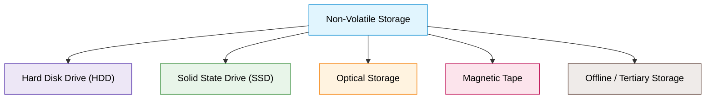
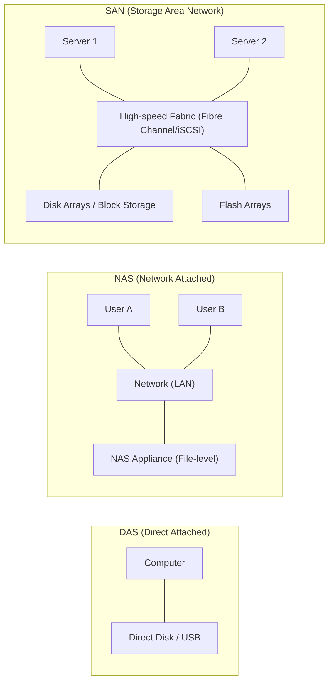

# Introduction to Storage Concepts

## 1. So sánh Memory (Bộ nhớ) vs Storage (Lưu trữ)

| Tiêu chí | Memory (Bộ nhớ RAM) | Storage (Lưu trữ / Ổ cứng) |
| :--- | :--- | :--- |
| **Tính chất lưu trữ** | **Volatile** (Bay hơi / Tạm thời - mất dữ liệu khi tắt nguồn) | **Non-volatile** (Bất biến / Bền vững - giữ dữ liệu khi tắt nguồn) |
| **Mục đích** | Lưu dữ liệu đang được CPU xử lý tích cực (*active processing*) | Lưu trữ và bảo toàn dữ liệu dài hạn (*long-term preservation*) |
| **Tốc độ / Độ trễ** | Rất nhanh, độ trễ cực thấp (*immediate access*) | Chậm hơn, có độ trễ truy xuất (*higher latency*) |
| **Chi phí / Dung lượng** | Chi phí/GB cao, dung lượng hạn chế | Chi phí/GB thấp, dung lượng lớn |
| **Vị trí** | Primary storage (Bộ nhớ sơ cấp) | Secondary / Tertiary storage (Lưu trữ thứ cấp / tam cấp) |

---

## 2. Các loại Non-Volatile Storage (Secondary Storage)

1. **Hard Disk Drive (HDD):**
   - Sử dụng đĩa từ quay cơ học (*spinning disks*).
   - **Ưu điểm:** Dung lượng lớn, chi phí trên mỗi GB thấp.
   - **Nhược điểm:** Tốc độ đọc/ghi trung bình, dễ tổn thương do va đập cơ học.
   - **Ứng dụng:** Server, PC, Laptop để lưu trữ dữ liệu dung lượng lớn.
2. **Solid State Drive (SSD):**
   - Sử dụng bộ nhớ flash (*flash memory*), không có bộ phận chuyển động cơ học.
   - **Ưu điểm:** Tốc độ đọc/ghi nhanh, độ bền cao, tiết kiệm điện năng.
   - **Nhược điểm:** Chi phí trên mỗi GB đắt hơn HDD.
   - **Ứng dụng:** Hệ điều hành, ứng dụng yêu cầu I/O cao trên Server, PC, Laptop.
3. **Optical Storage (Lưu trữ quang học):**
   - Sử dụng tia laser để đọc/ghi dữ liệu (CD, DVD, Blu-ray).
   - **Đặc điểm:** Chi phí rẻ, dung lượng mỗi đĩa hạn chế.
   - **Ứng dụng:** Phân phối nội dung đa phương tiện (*media distribution*) và lưu trữ lưu trữ (*archival*).
4. **Magnetic Tape (Băng từ):**
   - Công nghệ lưu trữ truyền thống lâu đời.
   - **Đặc điểm:** Tốc độ ghi nhanh, chi phí rất rẻ cho khối lượng dữ liệu khổng lồ, nhưng truy xuất ngẫu nhiên (*random access*) khó khăn và chậm.
   - **Ứng dụng:** Lưu trữ dữ liệu lưu trữ dài hạn (*archival*).
5. **Offline / Tertiary Storage (Lưu trữ tam cấp / ngoại tuyến):**
   - Dùng cho dữ liệu không cần truy cập thường xuyên (ổ cứng gắn ngoài, USB flash drive, Cloud Storage).
   - **Ứng dụng:** Sao lưu (*backup*), lưu trữ dự phòng tăng cường (*redundancy*).

---

## 3. Các kiến trúc lưu trữ chính (Storage Architectures)

1. **DAS (Direct Attached Storage):**
   - Thiết bị lưu trữ cắm trực tiếp vào máy tính (ổ cứng nội bộ, USB, external drive).
   - **Đặc điểm:** Thiết lập đơn giản, chi phí thấp, chỉ 1 máy/người dùng truy cập trực tiếp tại một thời điểm, khả năng mở rộng và chia sẻ hạn chế.
2. **NAS (Network Attached Storage):**
   - Thiết bị lưu trữ kết nối trực tiếp vào mạng nội bộ (LAN).
   - **Đặc điểm:** Cho phép nhiều client truy cập chia sẻ file từ xa qua mạng. Phù hợp cho doanh nghiệp vừa và nhỏ (SMB).
3. **SAN (Storage Area Network):**
   - Mạng chuyên dụng tốc độ cao tách biệt hạ tầng lưu trữ khỏi các server (kết nối đa server tới đa cụm lưu trữ).
   - **Đặc điểm:** Hiệu năng cao (Block-level storage), tính sẵn sàng cao (High Availability), khả năng mở rộng quy mô lớn, quản trị tập trung.
   - **Ứng dụng:** Data center và môi trường enterprise quy mô lớn.
4. **Cloud Storage:**
   - Dữ liệu được lưu trữ trên hạ tầng máy chủ từ xa của nhà cung cấp dịch vụ đám mây, truy cập qua Internet.
   - **Đặc điểm:** Lưu trữ dung lượng khổng lồ không cần đầu tư phần cứng vật lý, co giãn linh hoạt (*elasticity*).
   - **Nhà cung cấp tiêu biểu:** AWS (S3), Google Cloud Storage (GCS), Microsoft Azure Blob Storage.

---

## 4. Các khái niệm cốt lõi trong Data Storage

1. **Data Redundancy (Dư thừa dữ liệu) & Backup:**
   - **Redundancy:** Lưu nhiều bản sao dữ liệu ở các thiết bị/vị trí khác nhau để tự động phục hồi khi có lỗi phần cứng hoặc hỏng dữ liệu.
   - **Backup:** Quy trình chủ động sao chép dữ liệu sang vị trí bổ sung nhằm ngăn ngừa mất mát dữ liệu do sự cố/thảm họa.
2. **Data Compression (Nén dữ liệu):**
   - Giảm dung lượng dữ liệu nhằm tiết kiệm không gian lưu trữ và tăng tốc độ truyền tải mạng.
   - **Lossless (Không mất mát):** Phục hồi chính xác 100% dữ liệu gốc (phù hợp với text, code, database records).
   - **Lossy (Có mất mát):** Chấp nhận hy sinh một lượng nhỏ chi tiết không quan trọng để đạt tỉ lệ nén rất cao (thường dùng cho audio, video, hình ảnh).
3. **Data Encryption (Mã hóa dữ liệu):**
   - Biến đổi dữ liệu sang định dạng an toàn (*ciphertext*), ngăn chặn truy cập trái phép.
   - Chỉ người dùng/hệ thống có khóa giải mã (*decryption key*) hợp lệ mới đọc được dữ liệu.
4. **RAID (Redundant Array of Independent Disks):**
   - Công nghệ kết hợp nhiều ổ đĩa vật lý thành một đơn vị logic duy nhất.
   - Tối ưu hóa hiệu năng đọc/ghi và cung cấp khả năng chịu lỗi (*fault tolerance* / redundancy) qua các cấp độ RAID khác nhau (ví dụ: RAID 1 mirroring, RAID 5 striping with parity).
