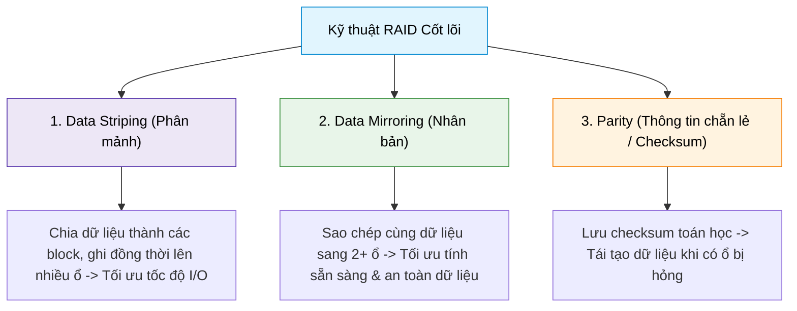
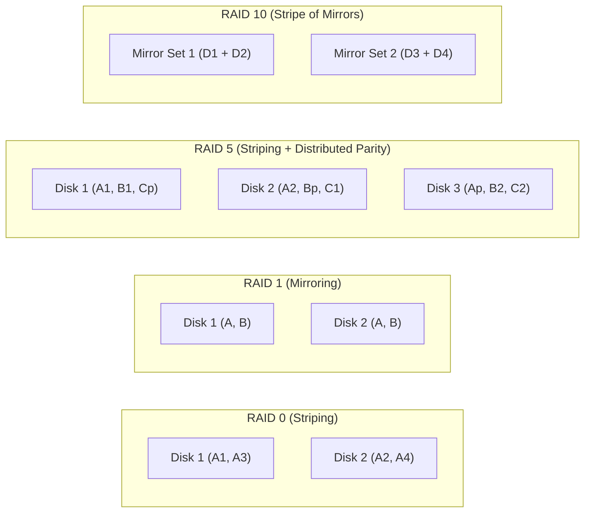

# RAID Concepts

## 1. Khái niệm & Mục tiêu của RAID
- **Định nghĩa:** RAID (**Redundant Array of Independent Disks**) là công nghệ lưu trữ dữ liệu kết hợp nhiều ổ đĩa vật lý thành một đơn vị logic duy nhất (**single logical unit**).
- **Mục tiêu chính:**
  - Tăng cường hiệu năng đọc/ghi (**enhance performance**).
  - Tăng dung lượng lưu trữ (**increase storage capacity**).
  - Cung cấp khả năng dự phòng và bảo vệ dữ liệu (**data redundancy / fault tolerance**).
- **Hình thức triển khai:**
  - **Hardware RAID:** Sử dụng card điều khiển chuyên dụng (*Dedicated RAID Controller*), hiệu năng cao, không tốn tài nguyên máy chủ.
  - **Software RAID:** Quản lý bởi hệ điều hành (*OS-managed*), tiết kiệm chi phí phần cứng nhưng chiếm dụng chu kỳ CPU máy chủ.

---

## 2. Các khái niệm cốt lõi trong RAID (Core Techniques)

1. **Data Striping (Phân mảnh dữ liệu):**
   - Chia nhỏ dữ liệu thành các block và phân phối đều trên nhiều ổ đĩa vật lý.
   - **Tác dụng:** Tăng tốc độ đọc/ghi đáng kể nhờ hoạt động I/O song song trên nhiều ổ cùng lúc.
   - **Hạn chế:** Bản thân Striping không có cơ chế dự phòng (nếu dùng riêng lẻ).
2. **Data Mirroring (Nhân bản / Gương):**
   - Sao chép dữ liệu y hệt nhau lên từ 2 ổ đĩa trở lên.
   - **Tác dụng:** Đảm bảo dữ liệu luôn khả dụng nếu 1 ổ bị chết.
   - **Hạn chế:** Dung lượng khả dụng bị giảm đi một nửa ($50\%$ usable capacity).
3. **Parity (Thông tin chẵn lẻ / Kiểm tra lỗi):**
   - Lưu trữ mã checksum/parity phân tán trên các ổ đĩa để tính toán khôi phục lại dữ liệu gốc khi có sự cố hỏng đĩa.
   - **Single Parity (RAID 5):** Khôi phục khi hỏng tối đa **1 ổ đĩa**.
   - **Double Parity (RAID 6):** Khôi phục khi hỏng đồng thời tối đa **2 ổ đĩa**.

---

## 3. Các cấp độ RAID phổ biến (Common RAID Levels)

| Cấp độ RAID | Kỹ thuật sử dụng | Số ổ đĩa tối thiểu | Khả năng chịu lỗi (*Fault Tolerance*) | Dung lượng khả dụng | Ưu điểm | Nhược điểm | Trường hợp sử dụng (*Use Case*) |
| :--- | :--- | :---: | :---: | :---: | :--- | :--- | :--- |
| **RAID 0** | Striping | 2 | **Không có (0 ổ)** | $100\%$ ($N \times \text{Size}$) | Hiệu năng đọc/ghi cao nhất | Mất 1 ổ là mất toàn bộ dữ liệu | Video editing, gaming, temporary caching |
| **RAID 1** | Mirroring | 2 | **1 ổ** | $50\%$ ($\text{Size of smallest disk}$) | Độ tin cậy cao, khôi phục dữ liệu nhanh | Tốn chi phí đĩa, hiệu suất ghi không tăng | Cơ sở dữ liệu (DBMS), OS critical servers |
| **RAID 5** | Striping + Distributed Parity | 3 | **1 ổ** | $(N - 1) \times \text{Size}$ | Cân bằng tốt giữa chi phí, dung lượng và hiệu năng | Tốc độ ghi chậm hơn do phải tính toán parity (*Write Penalty*) | File servers, web servers, enterprise storage |
| **RAID 6** | Striping + Double Parity | 4 | **2 ổ đồng thời** | $(N - 2) \times \text{Size}$ | An toàn cực cao trong mảng lưu trữ lớn | Chi phí đĩa cao hơn RAID 5, ghi chậm hơn | Mảng lưu trữ lớn (Big Data arrays), dữ liệu tài chính/y tế |
| **RAID 10** (1+0) | Stripe of Mirrors (Kết hợp RAID 1 & 0) | 4 (số chẵn) | **1 ổ trên mỗi mirror set** (lên tới $N/2$ ổ nếu khác set) | $50\%$ ($N/2 \times \text{Size}$) | Tốc độ đọc/ghi cực nhanh + Redundancy cao | Chi phí phần cứng đắt đỏ | Database giao dịch cao (OLTP), mission-critical apps |

---

## 4. Đánh giá Ưu điểm & Nhược điểm của RAID

### Ưu điểm (Advantages)
- **Tối ưu hiệu năng (Improved Performance):** Cho phép các tác vụ I/O đọc/ghi chạy đồng thời trên nhiều đĩa (RAID 0, RAID 10).
- **Dự phòng & Khả năng chịu lỗi (Data Redundancy):** Bảo vệ dữ liệu an toàn, duy trì tính sẵn sàng cao khi đĩa bị hỏng (RAID 1, RAID 5, RAID 6, RAID 10).
- **Khả năng mở rộng (Scalability):** Dễ dàng nâng dung lượng bằng cách gắn thêm ổ đĩa vào mảng.

### Nhược điểm & Rủi ro (Disadvantages)
- **Chi phí (Cost):** Tốn thêm ổ đĩa cho việc nhân bản/parity và cần phần cứng controller chuyên dụng.
- **Độ phức tạp (Complexity):** Cấu hình, bảo trì và thay thế đĩa phức tạp (đặc biệt là Software RAID gây áp lực CPU).
- **Rủi ro nhiều đĩa hỏng đồng thời (Multiple Failures):** Trong quá trình rebuild mảng RAID 5 bị hỏng 1 đĩa, tải I/O cao có thể kéo theo hỏng ổ thứ 2 gây mất dữ liệu toàn diện (khắc phục bằng RAID 6 hoặc RAID 10).
