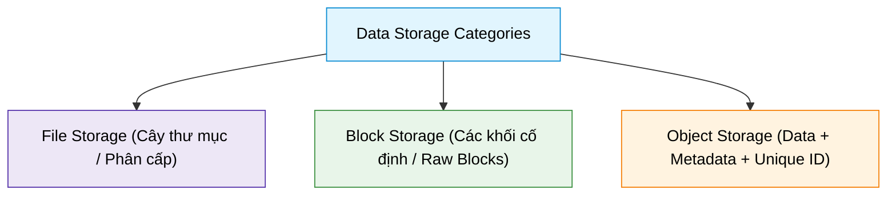
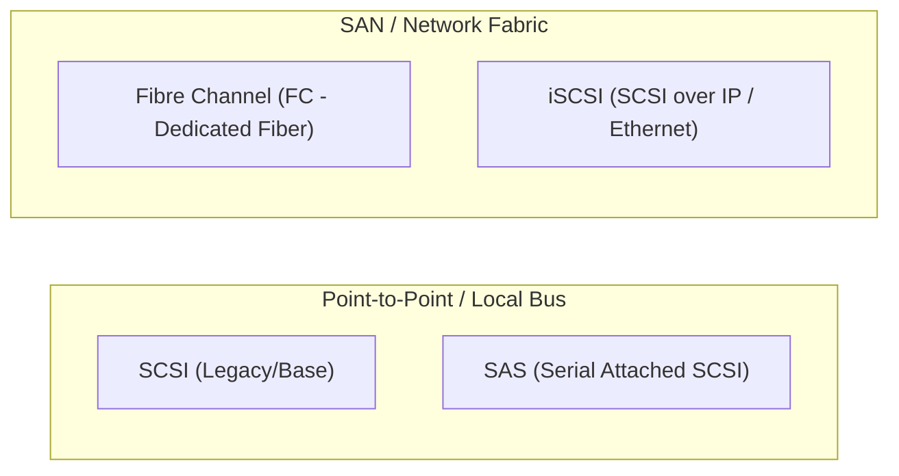
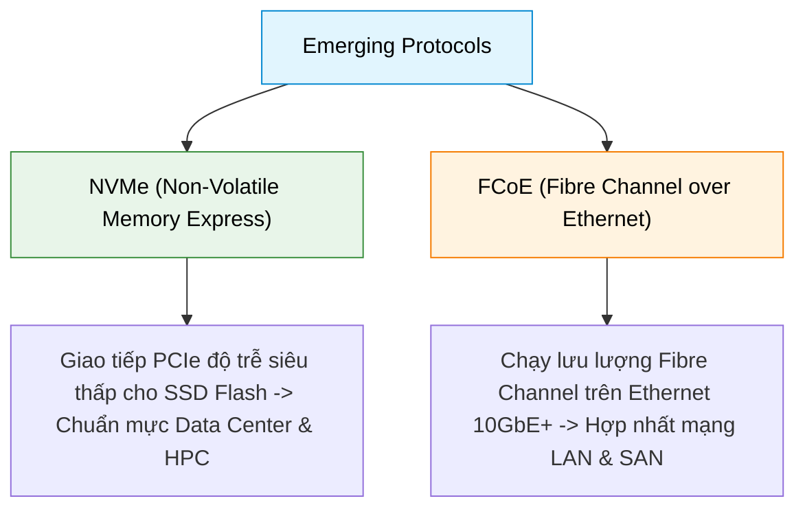

# Storage Protocols

## 1. Mục đích của Storage Protocols
- **Định nghĩa:** Storage Protocols (Giao thức lưu trữ) là tập hợp các quy tắc và tiêu chuẩn định nghĩa cách thức truyền tải dữ liệu hiệu quả và bảo mật giữa thiết bị lưu trữ (*storage devices*), máy chủ (*servers*) và máy khách (*clients*).
- **Vai trò:** Giúp hệ thống giao tiếp đồng bộ, tối ưu hóa băng thông, kiểm soát truy cập và độ trễ theo từng mô hình hạ tầng lưu trữ.

---

## 2. So sánh 3 mô hình lưu trữ dữ liệu (File vs Block vs Object)

| Tiêu chí | File Storage | Block Storage | Object Storage |
| :--- | :--- | :--- | :--- |
| **Cấu trúc dữ liệu** | Phân cấp dạng cây (Hierarchical: folders/directories & files) | Chia thành các khối cố định (Fixed-size chunks/blocks) quản lý độc lập | Dữ liệu đóng gói cùng Metadata chi tiết và Unique ID (Flat address space) |
| **Giao thức truy xuất** | File-level protocols (NFS, SMB/CIFS, AFP) | Block-level protocols (SCSI, FC, iSCSI, SAS, NVMe) | RESTful API qua HTTP/HTTPS (S3 API, Blob API) |
| **Độ trễ & Hiệu năng** | Trung bình | Rất nhanh, độ trễ cực thấp (*Low latency*) | Trung bình đến cao (*High throughput*) |
| **Trường hợp sử dụng** | Chia sẻ file văn phòng, NAS, máy tính cá nhân, chia sẻ thư mục đa người dùng | Cơ sở dữ liệu (Databases), Virtual Machines (VMs), hệ thống transaction lớn | Dữ liệu phi cấu trúc dung lượng khổng lồ (Video, hình ảnh, Backup, Archival, Data Lake) |

---

## 3. Các giao thức File Storage phổ biến

1. **NFS (Network File System):**
   - Do Sun Microsystems phát triển; hỗ trợ cả giao thức truyền tải TCP và UDP.
   - Cho phép client truy cập file từ xa qua mạng tương tự như thao tác trên ổ đĩa cục bộ.
   - Sử dụng phổ biến trong môi trường Linux/Unix và tập trung hóa quản lý file.
2. **SMB / CIFS (Server Message Block / Common Internet File System):**
   - Ban đầu do IBM phát triển, Microsoft hoàn thiện và mở rộng; hỗ trợ Windows, Linux và macOS.
   - Cung cấp tính năng mạnh mẽ: khóa tệp (*file locking*), duyệt thư mục, và xác thực người dùng (*user authentication*).
3. **AFP (Apple Filing Protocol):**
   - Giao thức chuyên dụng do Apple phát triển cho môi trường macOS.
   - Hiện nay trên các phiên bản macOS hiện đại, AFP hầu như đã được thay thế hoàn toàn bởi SMB.

---

## 4. Các giao thức Block Storage phổ biến

1. **SCSI (Small Computer System Interface):**
   - Một trong những giao thức lâu đời và phổ biến nhất, kết nối máy tính với thiết bị ngoại vi và ổ cứng.
   - Là nền tảng tập lệnh được kế thừa và đóng gói trong nhiều giao thức lưu trữ hiện đại.
2. **Fibre Channel (FC):**
   - Giao thức mạng lưu trữ tốc độ cao (lên tới 128 Gbps), sử dụng hạ tầng cáp quang chuyên dụng.
   - Độ tin cậy và an toàn cực cao; là tiêu chuẩn cốt lõi trong các mạng SAN (Storage Area Network) của trung tâm dữ liệu.
3. **iSCSI (Internet Small Computer System Interface):**
   - Đóng gói các lệnh SCSI để truyền qua mạng IP (Ethernet) tiêu chuẩn.
   - **Ưu điểm:** Tận dụng hạ tầng switch/cáp mạng Ethernet sẵn có, giảm mạnh chi phí triển khai SAN so với Fibre Channel mà vẫn đảm bảo hiệu năng cao.
4. **SAS (Serial Attached SCSI):**
   - Giao thức truyền thông điểm-đối-điểm (*point-to-point*) phát triển từ SCSI song song truyền thống.
   - Tốc độ truyền tải và khả năng mở rộng cao hơn nhiều so với SCSI cũ; chuyên dùng kết nối server với HDD/SSD hiệu năng cao.

---

## 5. Các giao thức mới nổi (Emerging Protocols)

1. **NVMe (Non-Volatile Memory Express):**
   - Thiết kế tối ưu riêng cho ổ cứng thể rắn SSD tốc độ cao qua bus PCIe.
   - Tận dụng băng thông lớn, độ trễ cực thấp và hỗ trợ hàng chục ngàn hàng đợi lệnh song song; vượt trội hoàn toàn so với các giao thức SAS/SATA truyền thống.
   - Ứng dụng mạnh mẽ trong Data Centers, AI/ML workload và High-Performance Computing (HPC).
2. **FCoE (Fibre Channel over Ethernet):**
   - Cho phép đóng gói và truyền tải trực tiếp frame Fibre Channel qua hạ tầng mạng Ethernet.
   - **Lợi ích:** Hợp nhất hạ tầng mạng mạng dữ liệu thông thường (LAN) và mạng lưu trữ (SAN) trên cùng một hệ thống cáp/switch, giảm độ phức tạp và chi phí đầu tư.
   - Phù hợp với hạ tầng mạng hợp nhất (*unified fabric*), telco và các nhà cung cấp cloud đa người thuê (*multi-tenant*).
