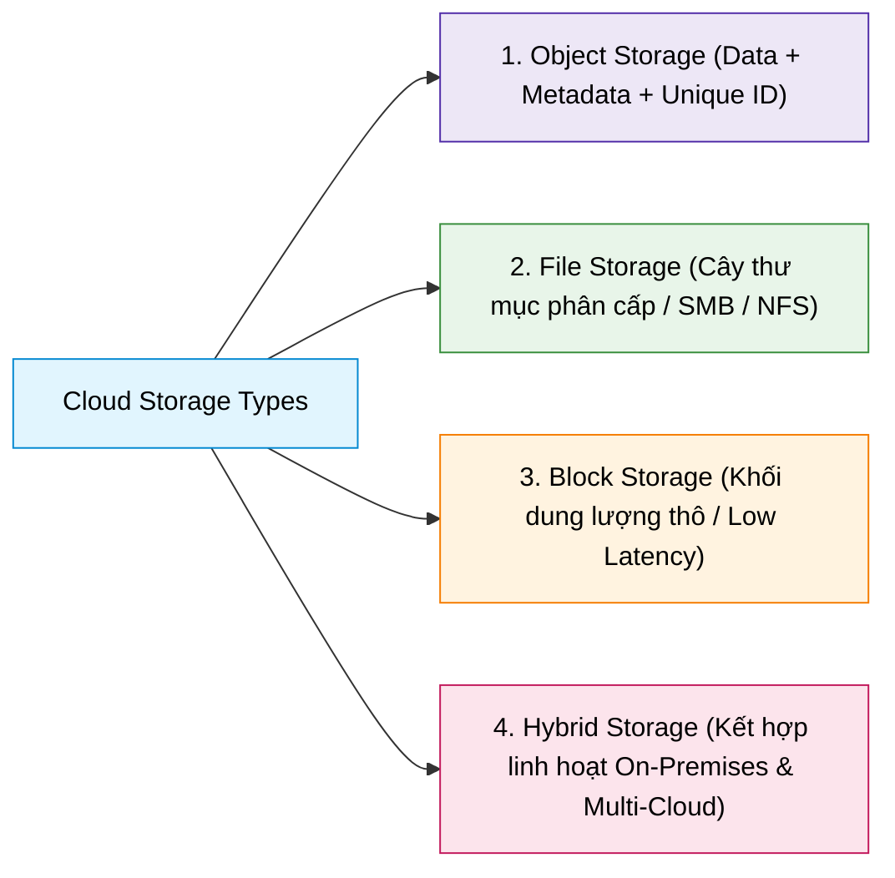
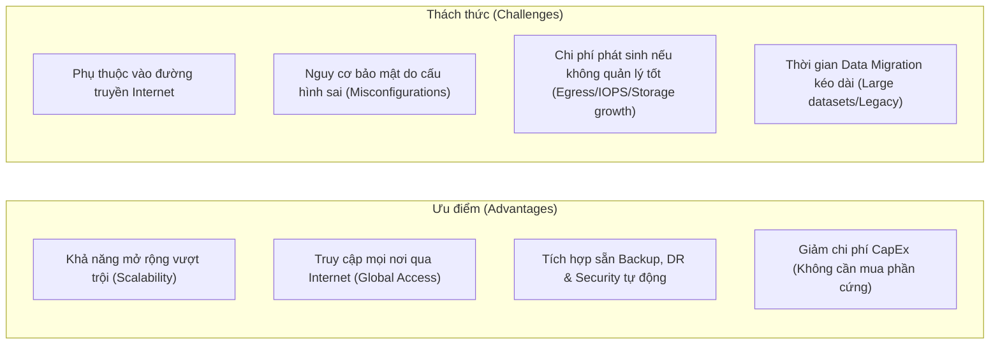

# Types of Cloud Storage

## 1. Tổng quan 4 loại Cloud Storage

---

## 2. Đặc điểm chi tiết & Use Cases từng loại

### 1. Object Storage (Lưu trữ theo đối tượng)
- **Cấu trúc:** Tổ chức dữ liệu thành các đơn vị rời rạc gọi là **Objects** nằm trong không gian địa chỉ phẳng (*flat namespace*). Mỗi object bao gồm:
  - **Data:** Dữ liệu thực tế.
  - **Metadata:** Thông tin mô tả có thể tùy biến linh hoạt (phục vụ index, search).
  - **Unique Identifier (ID):** Định danh duy nhất để truy xuất qua RESTful API/HTTP.
- **Đặc điểm nổi bật:**
  - Khả năng mở rộng vô hạn (*Massive Scalability*).
  - Khả năng tìm kiếm và đánh chỉ mục mạnh mẽ thông qua metadata.
  - Tính sẵn sàng và độ bền dữ liệu cực cao (*High Availability & Durability* - nhà cung cấp tự động nhân bản đa vùng).
- **Use Cases:**
  - Dữ liệu phi cấu trúc khối lượng lớn (Ảnh, Video, Âm thanh, Log files).
  - Data Lakes, Big Data analytics, Content Distribution (CDN backing).
  - Lưu trữ dự phòng (*Backup*) và lưu trữ dài hạn (*Archiving*).
  - Ví dụ Cloud: AWS S3, Google Cloud Storage (GCS), Azure Blob Storage.

### 2. File Storage (Lưu trữ theo tập tin)
- **Cấu trúc:** Tương tự hệ thống file truyền thống trên ổ cứng máy tính, tổ chức dạng cây thư mục phân cấp (*hierarchical directory structure: folders & files*).
- **Đặc điểm nổi bật:**
  - Đơn giản, quen thuộc, dễ tích hợp với các ứng dụng hiện có mà không cần sửa code.
  - Cho phép chia sẻ file đồng thời cho nhiều thiết bị/người dùng qua mạng (*Concurrent Access*).
  - Tương thích tốt với các giao thức chuẩn như **NFS** và **SMB/CIFS**.
- **Use Cases:**
  - Thư mục làm việc nhóm (*Collaborative team shares*), File server doanh nghiệp.
  - Hệ thống quản trị nội dung (*Content Management Systems - CMS*).
  - Lưu trữ tài liệu, repository mã nguồn dùng chung.
  - Ví dụ Cloud: AWS EFS / FSx, Google Cloud Filestore, Azure Files.

### 3. Block Storage (Lưu trữ theo khối)
- **Cấu trúc:** Dữ liệu được chia thành các khối có kích thước cố định (*fixed-size blocks*), mỗi khối được lưu trữ và quản lý độc lập. Không chứa metadata hay filesystem có sẵn; hoạt động như ổ cứng thô (*Raw storage*) cho phép format và phân vùng tùy ý từ OS.
- **Đặc điểm nổi bật:**
  - Hiệu năng cực cao, độ trễ siêu thấp (*Low latency*) và thông lượng đọc/ghi nhanh (*High IOPS*).
  - Có thể cấu hình linh hoạt về kích thước khối, throughput và tính dự phòng theo nhu cầu máy chủ ảo.
- **Use Cases:**
  - Cơ sở dữ liệu quan hệ và NoSQL (RDBMS: Oracle, MySQL, PostgreSQL; MongoDB,...).
  - Ổ đĩa gắn vào máy ảo (*Virtual Machine Disks / Root Volumes*).
  - Hệ thống xử lý giao dịch thời gian thực (*Transactional systems*), Mail servers.
  - Ví dụ Cloud: AWS EBS, Google Cloud Persistent Disk (PD), Azure Managed Disks.

### 4. Hybrid Storage (Lưu trữ lai)
- **Cơ chế:** Kết hợp linh hoạt giữa các mô hình Object, File và Block storage, hoặc tích hợp hạ tầng lưu trữ tại chỗ (**On-premises**) với **Cloud Storage**.
- **Đặc điểm nổi bật:**
  - Tối ưu hóa chi phí và hiệu năng: Dữ liệu "nóng" (Hot data) xử lý trên Block/File storage tốc độ cao tại chỗ, dữ liệu "nguội" (Cold data/Backup) tự động đẩy lên Cloud Object Storage giá rẻ.
  - Di chuyển dữ liệu liền mạch giữa các môi trường (*Seamless data movement*).
- **Use Cases:**
  - Doanh nghiệp đang trong lộ trình chuyển dịch lên đám mây (*Cloud Migration*).
  - Ứng dụng yêu cầu xử lý cục bộ độ trễ thấp kết hợp mở rộng dung lượng backup không giới hạn lên Cloud.
  - Môi trường Disaster Recovery (DR) và Data Tiering tự động.

---

## 3. Bảng so sánh tổng hợp 4 loại Cloud Storage

| Tiêu chí | Object Storage | File Storage | Block Storage | Hybrid Storage |
| :--- | :--- | :--- | :--- | :--- |
| **Mô hình tổ chức** | Flat space (Objects + Metadata + ID) | Thư mục phân cấp (Hierarchy) | Các khối độc lập (Raw Blocks) | Đa dạng / Kết hợp tùy biến |
| **Giao thức kết nối** | HTTP/HTTPS (REST API) | NFS, SMB/CIFS | iSCSI, FC, NVMe (Volume Attachment) | Tích hợp đa giao thức |
| **Hiệu năng & Độ trễ** | Throughput cao, độ trễ trung bình | Trung bình | Độ trễ cực thấp, IOPS rất cao | Tối ưu hóa theo từng tầng (Tiering) |
| **Khả năng mở rộng** | Không giới hạn (Petabytes+) | Vừa phải / Mở rộng theo NAS | Giới hạn theo kích thước volume | Cực kỳ linh hoạt |
| **Chi phí** | Rất rẻ / GB | Trung bình | Đắt hơn (trả theo dung lượng cấp phát) | Tối ưu tổng chi phí sở hữu (TCO) |

---

## 4. Ưu điểm & Thách thức của Cloud Storage

### Ưu điểm (Advantages)
- **Khả năng co giãn (Scalability):** Dễ dàng mở rộng lưu trữ dung lượng khổng lồ theo nhu cầu kinh doanh mà không cần dự toán mua sắm phần cứng trước.
- **Tính khả dụng toàn cầu (Accessibility):** Truy cập dữ liệu mọi lúc, mọi nơi có Internet, hỗ trợ làm việc từ xa và phân phối toàn cầu.
- **Tích hợp sẵn quản trị & an toàn dữ liệu:** Tự động hóa snapshot, backup, phục hồi thảm họa đa vùng (Multi-region replication) và các tính năng mã hóa nâng cao.

### Thách thức cần lưu ý (Challenges)
- **Phụ thuộc kết nối mạng:** Cần kết nối Internet ổn định và băng thông đủ lớn để đảm bảo tốc độ truyền tải.
- **Rủi ro bảo mật do cấu hình sai (Misconfiguration):** Việc vô tình mở public bucket hoặc cấp quyền IAM quá mức có thể dẫn đến rò rỉ dữ liệu.
- **Kiểm soát chi phí:** Chi phí có thể tăng vọt nếu không kiểm soát dung lượng lưu trữ, băng thông tải ra ngoài (*Egress fees*), hoặc số lượng I/O request.
- **Độ phức tạp khi Migration:** Quá trình di chuyển dữ liệu dung lượng lớn (Terabytes/Petabytes) từ hệ thống legacy lên cloud đòi hỏi thời gian, băng thông và chiến lược chuyển đổi chặt chẽ.
