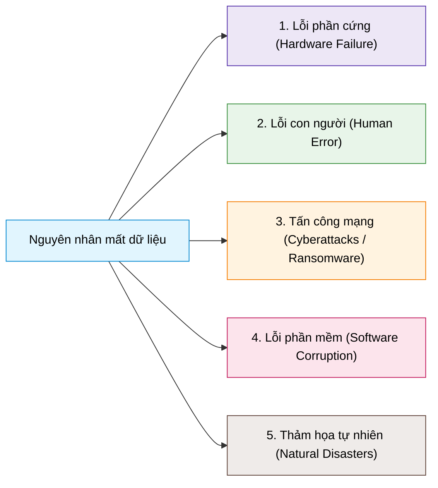
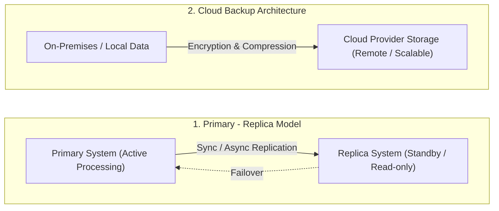

# Backup Fundamentals

## 1. Khái niệm & Tầm quan trọng của Data Backup
- **Định nghĩa:** Data Backup (Sao lưu dữ liệu) là quy trình sao chép và lưu trữ dữ liệu an toàn nhằm phục hồi hệ thống khi xảy ra sự cố mất mát (*loss*), hư hỏng (*corruption*) hoặc vô tình bị xóa (*accidental deletion*).
- **Tầm quan trọng:**
  - Bảo vệ tài sản số cốt lõi (tài liệu cá nhân, cơ sở dữ liệu doanh nghiệp, hồ sơ nhạy cảm).
  - Đảm bảo tính liên tục của hoạt động kinh doanh (**business continuity**); nhiều doanh nghiệp không có chiến lược backup phù hợp đã không thể phục hồi sau thảm họa dữ liệu lớn.

---

## 2. Các nguyên nhân gây mất dữ liệu (Causes of Data Loss)

1. **Lỗi phần cứng (Hardware Failures):** Ổ cứng HDD/SSD bị hỏng do hao mòn tự nhiên (*wear and tear*), lỗi sản xuất hoặc tác động vật lý bên ngoài.
2. **Lỗi con người (Human Error):** Vô tình xóa nhầm file, format nhầm ổ đĩa, cấu hình sai hệ thống (*misconfiguration*).
3. **Tấn công mạng (Cyberattacks & Ransomware):** Virus, malware và đặc biệt là mã độc tống tiền (*ransomware*) mã hóa toàn bộ dữ liệu đòi tiền chuộc.
4. **Hư hỏng phần mềm (Software Corruption):** Bugs, lỗi crash ứng dụng hoặc hệ quản trị cơ sở dữ liệu làm hỏng cấu trúc file dữ liệu.
5. **Thảm họa tự nhiên (Natural Disasters):** Hỏa hoạn, lũ lụt, động đất phá hủy vật lý toàn bộ trung tâm dữ liệu (nhấn mạnh tầm quan trọng của Offsite / Cloud Backup).

---

## 3. Các cấu hình Backup chính (Backup Configurations)

### 1. Mô hình Primary - Replica (Chính - Bản sao)
- **Cơ chế:** Dữ liệu được lưu trữ và xử lý chính tại hệ thống Primary, sau đó được nhân bản theo thời gian thực (*real-time*) hoặc định kỳ (*intervals*) sang hệ thống phụ (Secondary/Replica).
- **Đặc điểm & Lợi ích:**
  - Cung cấp tính sẵn sàng cao (**High Availability**) và dự phòng dữ liệu tức thì.
  - Khi hệ thống Primary gặp sự cố, Replica có thể nhanh chóng tiếp quản (**Failover**) giúp giảm thiểu downtime.
- **Thách thức:** Cần quản lý chặt chẽ tính nhất quán dữ liệu (*Data Consistency*), độ trễ truyền tải (*Replication Latency*) và xử lý xung đột trong các môi trường giao dịch cao.

### 2. Mô hình Cloud Backup (Sao lưu đám mây)
- **Cơ chế:** Sao chép dữ liệu lên máy chủ đám mây từ xa do bên thứ ba quản lý (AWS, GCP, Azure).
- **Đặc điểm & Lợi ích:**
  - **Khả năng tiếp cận từ xa:** Dễ dàng truy xuất dữ liệu từ bất cứ đâu.
  - **Chống rủi ro cục bộ:** Miễn nhiễm với sự cố phần cứng tại chỗ, trộm cắp hoặc thiên tai tại data center cục bộ.
  - **Bảo mật cao:** Mã hóa toàn diện cả khi truyền tải (*in transit*) và khi lưu trữ (*at rest*).
  - **Tối ưu không gian:** Tích hợp công nghệ chống trùng lặp dữ liệu (**Data Deduplication**) và nén dữ liệu (**Compression**).
  - **Co giãn linh hoạt (Elastic Scalability):** Mở rộng dung lượng theo nhu cầu mà không cần đầu tư mua thêm phần cứng.
- **Thách thức cần lưu ý:** Băng thông mạng, tốc độ truyền tải khi restore dữ liệu lớn và tuân thủ các quy định bảo mật/pháp lý (*Compliance*).

---

## 4. Các phương tiện lưu trữ sao lưu (Backup Media)

| Nhóm phương tiện | Loại thiết bị | Đặc điểm & Đánh giá |
| :--- | :--- | :--- |
| **Traditional Media** *(Truyền thống)* | **Magnetic Tape** (Băng từ) | Chi phí cực rẻ trên mỗi Terabyte, dung lượng lưu trữ khổng lồ, phù hợp lưu trữ lâu năm (*archiving*), nhưng tốc độ truy xuất ngẫu nhiên chậm. |
| | **Optical Discs** (CD, DVD, Blu-ray) | Giá rẻ, dung lượng mỗi đĩa nhỏ, thường chỉ dùng cho dữ liệu nhỏ hoặc phân phối nội dung. |
| | **Hard Disk Drives** (HDD) | Dung lượng lớn, chi phí hợp lý, tốc độ truy xuất nhanh hơn băng từ nhưng dễ hỏng hóc cơ học. |
| **Modern Media** *(Hiện đại)* | **Solid State Drives** (SSD) | Tốc độ đọc/ghi cực nhanh, độ bền cao không cơ học, thích hợp cho backup cục bộ yêu cầu thời gian phục hồi ngắn. |
| | **Cloud Storage** | Co giãn không giới hạn, độ bền dữ liệu cao (99.999999999%), bảo vệ trước thảm họa cục bộ, tích hợp sẵn mã hóa và phân tầng lưu trữ (*tiering*). |
