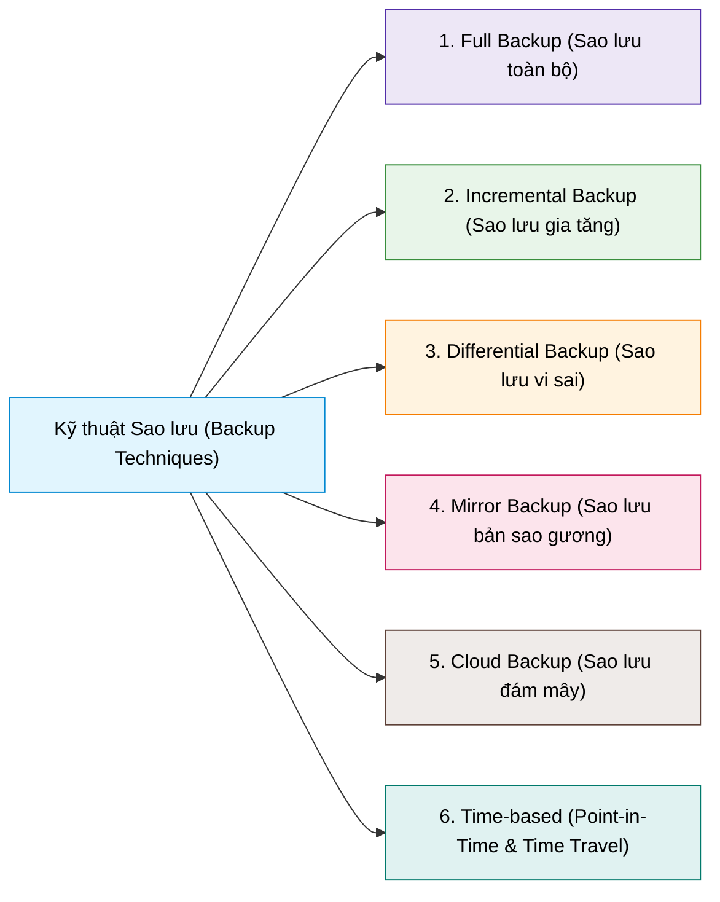
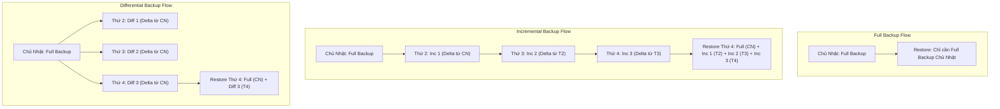
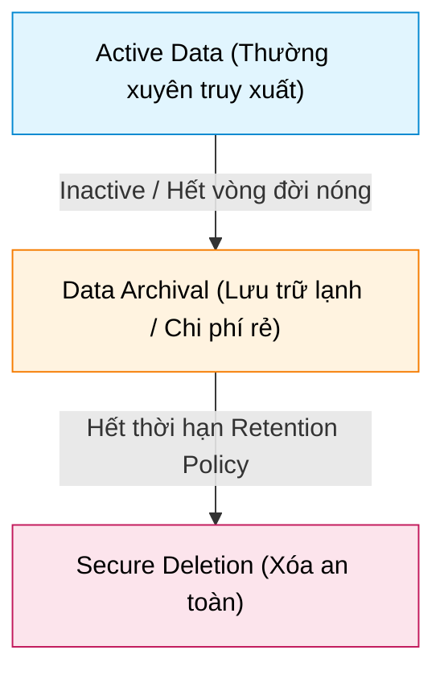

# Backup Techniques

## 1. Tổng quan các kỹ thuật Backup (Backup Techniques)

---

## 2. Chi tiết các kỹ thuật Backup

### 1. Full Backup (Sao lưu toàn bộ)
- **Cơ chế:** Sao chép toàn bộ dữ liệu và file trong hệ thống tại thời điểm sao lưu.
- **Ưu điểm:**
  - Đơn giản, đáng tin cậy nhất.
  - Phục hồi cực nhanh và dễ dàng vì tất cả dữ liệu nằm tập trung tại một bản duy nhất.
- **Nhược điểm:** Tốn nhiều thời gian thực hiện, chiếm nhiều dung lượng lưu trữ, chi phí cao.
- **Phù hợp:** Doanh nghiệp nhỏ, dữ liệu ít thay đổi hoặc chạy định kỳ (cuối tuần/cuối tháng).

---

### 2. Incremental Backup (Sao lưu gia tăng)
- **Cơ chế:** Dựa trên bản Full backup ban đầu, các lần tiếp theo **chỉ sao lưu phần dữ liệu thay đổi so với lần backup gần nhất** (bất kể lần gần nhất là Full hay Incremental).
- **Ưu điểm:** Tốc độ backup rất nhanh, chiếm ít dung lượng lưu trữ nhất, chi phí lưu trữ thấp.
- **Nhược điểm:**
  - Quy trình phục hồi (**Restore**) phức tạp: Cần bản **Full backup cuối cùng + TẤT CẢ các bản Incremental** theo đúng thứ tự tuần tự.
  - Nếu một bản Incremental ở giữa bị hỏng (corrupted), toàn bộ chuỗi phục hồi sau đó sẽ bị lỗi.
- **Phù hợp:** Hệ thống có dữ liệu thay đổi thường xuyên, dịch vụ web động.

---

### 3. Differential Backup (Sao lưu vi sai)
- **Cơ chế:** Dựa trên bản Full backup ban đầu, các lần tiếp theo **sao lưu tất cả dữ liệu thay đổi kể từ bản Full backup ban đầu** (bỏ qua các lần Differential trước đó).
- **Ưu điểm:** Phục hồi đơn giản hơn Incremental: Chỉ cần **bản Full backup cuối cùng + bản Differential mới nhất**.
- **Nhược điểm:** Dung lượng các bản Differential sẽ ngày càng phình to theo thời gian cho đến lần Full backup tiếp theo, tốn dung lượng hơn Incremental.
- **Phù hợp:** Tổ chức có mức độ thay đổi dữ liệu trung bình, muốn cân bằng giữa tốc độ backup và thời gian khôi phục.

---

### 4. So sánh trực quan cơ chế Restore: Full vs Incremental vs Differential

---

### 5. Mirror Backup (Sao lưu bản sao gương)
- **Cơ chế:** Tạo bản sao y hệt dữ liệu nguồn theo thời gian thực hoặc định kỳ, **không giữ lại phiên bản cũ (versioning)**.
- **Đặc điểm:** Nếu file nguồn bị xóa hoặc sửa đổi nhầm, bản Mirror cũng sẽ phản ánh việc xóa/sửa đó ngay lập tức.
- **Ưu điểm:** Khôi phục nhanh chóng, file dữ liệu không bị đóng gói.
- **Nhược điểm & Rủi ro:** Không chống được lỗi người dùng (xóa nhầm) hoặc ransomware lây nhiễm trực tiếp. Phù hợp cho Content Management Systems (CMS) cần tính đồng bộ.

---

### 6. Cloud Backup (Sao lưu đám mây)
- **Cơ chế:** Chuyển và lưu trữ bản sao dữ liệu tại các Data Center từ xa của nhà cung cấp dịch vụ bên thứ ba (AWS, GCP, Azure,...).
- **Ưu điểm:**
  - Chống rủi ro thiên tai/hỏa hoạn cục bộ (**Offsite protection**).
  - Khả năng mở rộng dung lượng linh hoạt, giảm gánh nặng vận hành phần cứng.
- **Lưu ý:** Cần mã hóa dữ liệu cả khi truyền tải (*in transit*) và lưu trữ (*at rest*), đồng thời quản lý chi phí thuê bao định kỳ và băng thông.

---

### 7. Time-based Backups (Point-in-Time & Time Travel)
- **Point-in-Time Backup (Sao lưu theo thời điểm):**
  - Chụp snapshot hệ thống/cơ sở dữ liệu tại các mốc thời gian cụ thể.
  - Phục hồi trạng thái chính xác của dữ liệu tại mốc thời gian đó, hạn chế tối đa thất thoát dữ liệu.
- **Time Travel Backup (Sao lưu dòng thời gian):**
  - Cho phép người dùng duyệt ngược lại nhiều phiên bản lịch sử của dữ liệu và khôi phục về bất kỳ trạng thái nào trong quá khứ.
  - Phù hợp cho môi trường thay đổi dữ liệu liên tục và cần rollback nhiều phiên bản.

---

## 3. Bảng so sánh tổng hợp các kỹ thuật Backup

| Tiêu chí | Full Backup | Incremental Backup | Differential Backup | Mirror Backup | Cloud Backup |
| :--- | :--- | :--- | :--- | :--- | :--- |
| **Thời gian Backup** | Rất chậm | Rất nhanh | Nhanh / Trung bình | Rất nhanh | Tùy thuộc băng thông |
| **Dung lượng sử dụng** | Rất lớn | Rất nhỏ | Tăng dần theo thời gian | Bằng dữ liệu gốc | Co giãn linh hoạt |
| **Thời gian Restore** | Rất nhanh | Chậm (chuỗi nhiều file) | Nhanh (Full + Last Diff) | Rất nhanh | Phụ thuộc tốc độ mạng |
| **Rủi ro mất dữ liệu** | Thấp | Cao (nếu hỏng 1 bản con) | Thấp | Cao (xóa nhầm bị sync) | Thấp (nếu bảo mật tốt) |
| **Yêu cầu Restore** | 1 bản Full | Full + Toàn bộ Incs | Full + 1 bản Diff mới nhất | Bản Mirror hiện tại | Download từ Cloud |

---

## 4. Data Archival (Lưu trữ lịch sử) & Retention Policies (Chính sách lưu giữ)

1. **Data Archival (Lưu trữ lịch sử / Lưu trữ lạnh):**
   - Di chuyển dữ liệu không còn hoạt động (*inactive data*) sang hệ thống lưu trữ riêng biệt phục vụ mục đích bảo toàn lâu dài.
   - **Mục đích:** Tra cứu tương lai, kiểm toán, pháp lý, và tuân thủ quy chuẩn (*compliance*).
   - **Đặc điểm:** Sử dụng các phương tiện lưu trữ giá rẻ, tốc độ truy xuất chậm hơn (Cold/Archive storage, Băng từ).
2. **Data Retention Policies (Chính sách lưu giữ dữ liệu):**
   - Quy định rõ ràng **thời gian cần lưu giữ** từng loại dữ liệu trước khi được xóa bỏ an toàn (*securely deleted*).
   - Được thiết lập dựa trên yêu cầu pháp luật, quy định ngành (GDPR, HIPAA, PCI-DSS) và nhu cầu kinh doanh.
   - **Lợi ích:** Đảm bảo sẵn sàng dữ liệu khi cần, tối ưu hóa chi phí lưu trữ, và giảm thiểu rủi ro pháp lý khi nắm giữ dữ liệu lỗi thời không cần thiết.
