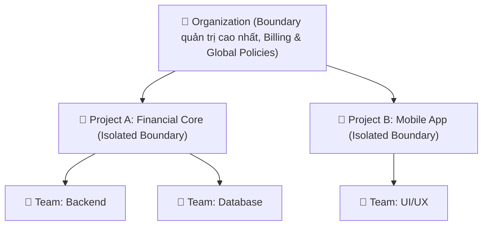
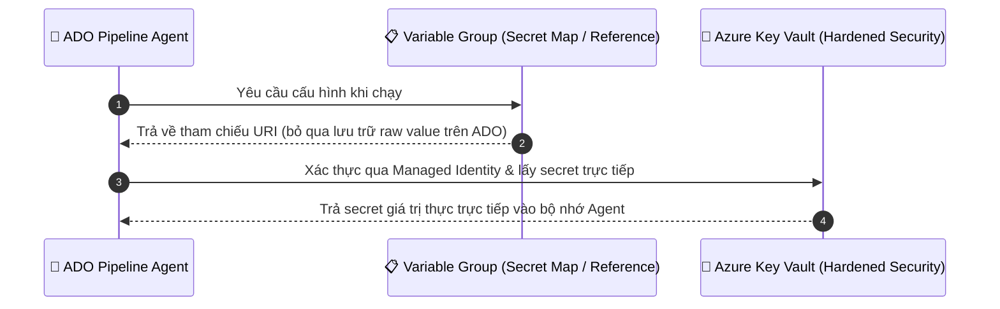

# Azure DevOps Structural Components

> **Course**: Microsoft DevOps Engineering  
> **Module**: Course 1 - DevOps Platforms & Source Control  
> **Topic**: Architectural Hierarchy, Compute & Security Controls  

---

## 1. Cấu trúc phân tầng (The Hierarchy): Organizations, Projects, and Teams

Để triển khai quản trị an toàn và tuân thủ các chuẩn như **SOX** và **ISO 27001**, việc phân định ranh giới (isolation boundaries) trong Azure DevOps là yếu tố cốt lõi:

| Cấp độ | Vai trò & Đặc điểm quản trị |
| :--- | :--- |
| **Organizations** | Cấp cao nhất, đại diện cho doanh nghiệp hoặc khối kinh doanh lớn. Quản lý billing, user, liên kết Azure Subscription và chính sách an ninh toàn cục. |
| **Projects** | **Đơn vị cách ly chính (Primary Unit of Isolation)** chứa Repos, Pipelines, Permissions.  ⚠️ **Quy tắc tuân thủ (SoD)**: Không dùng 1 project duy nhất cho toàn bộ công ty. Phải tách riêng project theo sản phẩm/khối nghiệp vụ (ví dụ: tách biệt hệ thống Tài chính nhạy cảm khỏi Mobile App). |
| **Teams** | Phân nhóm làm việc nội bộ trong Project (Backend, Frontend, Data...). Quản lý Backlogs, Boards và Dashboards riêng dưới sự quản trị chung của Project. |

---

## 2. Quản lý tài nguyên tính toán: Agent Pools (Compute)

Agent là phần mềm thực thi các công việc trong pipeline (build, test, deploy). Việc lựa chọn loại Agent ảnh hưởng trực tiếp đến an ninh mạng và tuân thủ:

| Loại Agent | Ưu điểm | Hạn chế / Đánh giá an ninh |
| :--- | :--- | :--- |
| **Microsoft-hosted Agents** | - Môi trường ảo hóa sạch sẽ cho mỗi lần chạy. - Không mất công bảo trì hạ tầng. | - Chạy **bên ngoài mạng nội bộ (private network)**. - Không thể kết nối trực tiếp vào tài nguyên nội bộ sau Firewall/Private Endpoint. |
| **Self-hosted Agents** | - Cài đặt trên máy chủ riêng (on-premises hoặc private cloud). - Toàn quyền kiểm soát phần mềm, OS và kết nối mạng nội bộ. | - Cần tự quản lý, bảo trì. ⭐ **Yêu cầu bắt buộc cho Compliance**: Giữ dữ liệu trong mạng riêng. Khuyến nghị tách riêng **Dev Pool** và **Hardened Production Pool**. |

---

## 3. Quản lý kết nối bên ngoài: Service Connections

Service Connection là đối tượng lưu trữ thông tin xác thực để pipeline tương tác với các hệ thống ngoài (Azure, Docker Registry, Kubernetes, Database...).

- **Nguyên tắc an ninh**:
  - **Không bao giờ hardcode credentials** (API keys, passwords) vào mã nguồn hoặc script pipeline.
  - **Ưu tiên Managed Identity**: Nên dùng *Managed Identity* thay cho *Service Principal* truyền thống vì Microsoft Entra ID tự động xoay vòng (rotate) credentials, loại bỏ hoàn toàn rủi ro lộ secret thủ công.
  - **Giới hạn phạm vi (Least Privilege)**: Phân quyền Service Connection chỉ cho các pipeline cụ thể được phép sử dụng và yêu cầu phê duyệt từ Admin, ngăn chặn nguy cơ di chuyển ngang (*Lateral Movement*).

---

## 4. Bảo mật Secrets: Variable Groups & Azure Key Vault

### Cách quản lý Secrets chuẩn Enterprise:
1. **Không lưu Plain-text Secrets trên Azure DevOps**: Thay vì nhập trực tiếp secret vào Variable Group, hãy **link Variable Group tới Azure Key Vault**.
2. **Cơ chế hoạt động**:
   - Variable Group chỉ đóng vai trò là một **bản đồ tham chiếu (reference map)** chứa URI trỏ tới Key Vault.
   - Giá trị secret thực tế **không bao giờ được lưu trữ trên Azure DevOps platform**.
   - Khi chạy pipeline, Agent sử dụng Managed Identity để tải secret trực tiếp từ Azure Key Vault vào bộ nhớ tạm.
3. **Lợi ích**:
   - **Tập trung hóa quản trị**: Quản lý và audit secret tại một phân vùng an ninh kiên cố độc lập.
   - **Bảo mật phía Dev**: Lập trình viên và Pipeline Admin không thấy được raw secret value.
   - **Zero Pipeline Modification**: Xoay vòng (rotate) secret trong Key Vault mà không cần chỉnh sửa pipeline.
