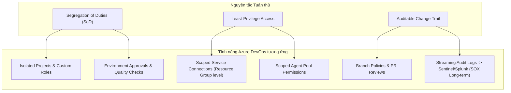
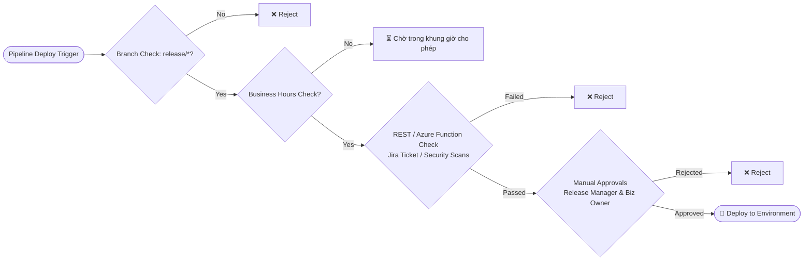

# Designing for SOX and ISO 27001 Compliance

> **Course**: Microsoft DevOps Engineering  
> **Module**: Course 1 - DevOps Platforms & Source Control  
> **Topic**: Translating Compliance (SOX, ISO 27001) into Azure DevOps Architecture  

---

## 1. Triết lý "Compliant by Design"

- **Yêu cầu kiểm toán thực tế**:
  - **SOX 404**: Yêu cầu bằng chứng về sự kiểm soát liên tục trong suốt kỳ báo cáo tài chính (thường là 12 tháng).
  - **ISO 27001**: Yêu cầu xác minh các biện pháp kiểm soát an toàn thông tin thực sự có hiệu lực khi vận hành, không chỉ nằm trên giấy tờ tài liệu.
- **Nguyên tắc cốt lõi**: Tuân thủ không phải là bước kiểm tra sau cùng (afterthought), mà phải được tích hợp sẵn vào kiến trúc nền tảng (*Compliant by Design*).

---

## 2. Bản đồ ánh xạ Tiêu chuẩn vào tính năng Azure DevOps

### 1. Phân tách Nhiệm vụ (Segregation of Duties - SoD)
*Không một cá nhân nào nắm toàn quyền từ đầu đến cuối một quy trình trọng yếu (đặc biệt là các hệ thống tài chính).*

- **Projects**: Phân chia project riêng biệt cho team phát triển hệ thống tài chính với team quản lý hạ tầng/tooling.
- **Security Groups**: Tách bạch quyền hạn (Developer viết code & build CI $\neq$ Release Manager phê duyệt lên Production).
- **Environment Approvals**: Bắt buộc có người phê duyệt trước khi deployment diễn ra.

### 2. Nguyên tắc Đặc quyền Tối thiểu (Least-Privilege Access)
*Giảm thiểu phạm vi ảnh hưởng (blast radius) và ngăn chặn di chuyển ngang (lateral movement - bài học từ vụ tấn công MGM).*

- **Custom Security Groups**: Không dùng các nhóm mặc định quá rộng như `Contributors`. Tạo các nhóm tùy chỉnh theo vai trò thực tế.
- **Scoped Service Connections**: **Không cấp quyền Owner/Contributor ở cấp Subscription**. Phải dùng Managed Identity gán quyền hạn tối thiểu tại cấp Resource Group cụ thể (ví dụ: chỉ có quyền deploy vào 1 App Service xác định).
- **Agent Pool Permissions**: Chỉ cho phép các release pipeline đã qua kiểm định sử dụng Production Agent Pool đặt trong Private Network. *(Lưu ý: Phân quyền này hỗ trợ mặc định cho YAML pipelines; với Classic pipelines cần cấu hình role tại cấp Agent Pool)*.

### 3. Lưu vết Kiểm toán Đầy đủ (Auditable Change Trail)
*Phục vụ việc tái hiện "Ai, Làm gì, Khi nào, và Tại sao" đối với mọi thay đổi trên Production.*

- **Git History & Pull Requests**: Bắt buộc thông qua Branch Policies để lưu vết thảo luận và review.
- ⚠️ **Lưu ý quan trọng về Audit Logs**:
  > [!WARNING]
  > Mặc định, Azure DevOps Audit Logs chỉ lưu trữ trong **90 ngày**. Để đáp ứng yêu cầu lưu trữ nhiều năm của SOX, **bắt buộc phải cấu hình stream logs sang các dịch vụ ngoài** như *Azure Monitor, Microsoft Sentinel, hoặc Splunk*.
- **Pipeline Logs & Approval History**: Tự động ghi nhận thông tin thực thi và lịch sử ký duyệt deployment.

---

## 3. Thiết kế Custom Security Groups chuẩn Least-Privilege

| Nhóm Security Group | Quyền hạn được cấp | Ranh giới cấm / Hạn chế |
| :--- | :--- | :--- |
| **`[Project] Developers`** | Tạo branch, commit code, chạy build deploy lên môi trường **Dev**. | Không push trực tiếp lên `main`, không deploy lên **QA** hoặc **Prod**. |
| **`[Project] QA Analysts`** | Kích hoạt deployment lên môi trường **QA** để kiểm thử. | Không sửa mã nguồn repo, không deploy lên **Prod**. |
| **`[Project] Release Managers`** | Nhóm duy nhất có quyền **phê duyệt** deployment lên **Production**. | **Bị từ chối quyền ghi/commit vào Repo** (không nằm trong nhóm Contributors). |

---

## 4. Cẩm nang cấu hình Approvals and Checks trên Environments

> **Đường dẫn**: `Pipelines` $\rightarrow$ `Environments` $\rightarrow$ `[Chọn Environment]` $\rightarrow$ `Approvals and checks` $\rightarrow$ `+ Add new`

1. **Manual Approvals**:
   - Đòi hỏi sự phê duyệt thủ công từ các cá nhân/nhóm cụ thể (ví dụ: mô hình phê duyệt kép gồm **Release Manager** + **Business Owner**).
2. **Branch Control Checks**:
   - Chỉ cho phép deploy từ các nhánh chỉ định (ví dụ: `refs/heads/release/*`), ngăn deploy nhầm từ nhánh tính năng (feature branches).
   - Kiểm tra nhánh nguồn phải có **chính sách bảo vệ đang hoạt động** (active protection policies).
3. **Business Hours Checks**:
   - Giới hạn thời gian deploy chỉ diễn ra trong giờ làm việc hành chính, tránh các sự cố lúc nửa đêm khi đội ngũ hỗ trợ vắng mặt.
4. **Invoke Azure Function / REST API Checks**:
   - Tự động gọi hệ thống bên ngoài để thẩm định chất lượng/quy trình (kiểm tra trạng thái Change Request trên Jira/Azure Boards, kiểm tra kết quả quét lỗ hổng SonarQube/Trivy).
   - **2 Chế độ thực thi**:
     - *Asynchronous (Bất đồng bộ)*: Azure Function xử lý và gọi ngược lại (callback) Azure DevOps để trả kết quả Pass/Fail.
     - *Synchronous (Đồng bộ)*: Azure DevOps thực hiện thăm dò (polling) API định kỳ cho đến khi có kết quả.
