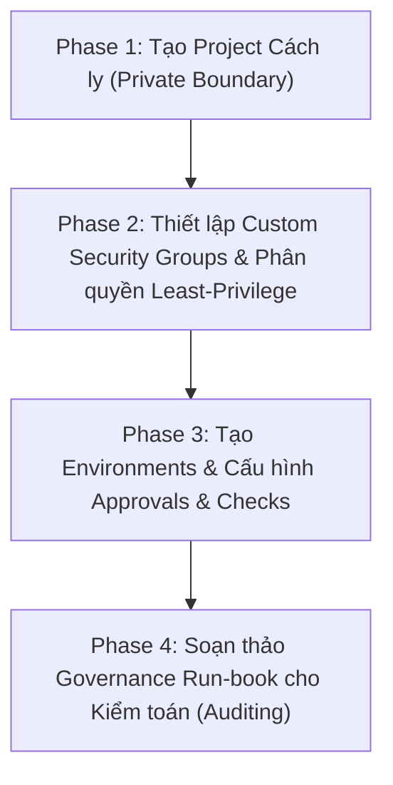
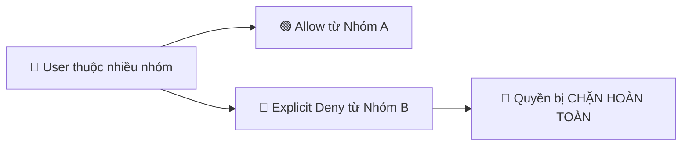

# Step-by-Step: Implementing the Governance Model

> **Course**: Microsoft DevOps Engineering  
> **Module**: Course 1 - DevOps Platforms & Source Control  
> **Topic**: Hands-on Implementation of SOX & ISO 27001 Compliant Platform Governance  

---

## 1. Tổng quan quy trình triển khai (Implementation Workflow)

---

## Phase 1: Tạo cấu trúc Project cách ly (Isolated Project Structure)

1. **Khởi tạo Project**:
   - Truy cập Organization Dashboard $\rightarrow$ **+ New project**.
   - Đặt tên mang tính định danh rõ ràng (ví dụ: `Corporate-Payment-Services`).
   - ⚠️ **Visibility**: Bắt buộc chọn **Private**. Không dùng Public project vì sẽ làm lộ mã nguồn, backlog và cấu hình thanh toán ra Internet.

---

## Phase 2: Triển khai Custom Security Groups (Least Privilege)

Tuyệt đối **không** dùng nhóm `Contributors` mặc định cho các vai trò chính vì quyền hạn quá rộng.

### 1. Tạo 3 Custom Security Groups
Tại `Project settings` $\rightarrow$ `General` $\rightarrow$ `Permissions` $\rightarrow$ tab `Groups` $\rightarrow$ **New group**:
- `Corporate-Payment-Svc Developers` (Lập trình viên)
- `Corporate-Payment-Svc QA Analysts` (Kiểm thử viên)
- `Corporate-Payment-Svc Release Managers` (Người duyệt phát hành)

### 2. Thiết lập quyền hạn & Nguyên tắc Deny

- **Chặn vượt quyền Branch Policies**:
  - `Project Settings` $\rightarrow$ `Repos` $\rightarrow$ `Repositories` $\rightarrow$ Chọn Repo $\rightarrow$ tab `Security`.
  - Chọn nhóm `Contributors` $\rightarrow$ Tìm quyền **Bypass policies when completing pull requests** $\rightarrow$ Chọn **Deny**.
- **Chặn xóa Work Items bừa bãi**:
  - `Project Settings` $\rightarrow$ `General` $\rightarrow$ `Permissions` $\rightarrow$ Chọn `Contributors`.
  - Dưới mục **Boards** $\rightarrow$ Tìm quyền **Delete and restore work items** $\rightarrow$ Chọn **Deny**.

> [!IMPORTANT]
> **Quy tắc phân định phạm vi & Ưu tiên Deny trong Azure DevOps**:
> - **Explicit Deny luôn thắng Allow**: Nếu một người vừa ở nhóm Developers (bị Deny) vừa ở nhóm Release Managers (được Allow), hành động đó **vẫn bị chặn**.
> - **Phạm vi phân quyền**: Quyền liên quan đến Git/PR nằm ở `Repos Settings`; quyền liên quan đến Backlog/Work Items nằm ở `Project Settings → Permissions → Boards`.

---

## Phase 3: Cấu hình Environments, Approvals & Checks

Ngăn chặn việc một cá nhân tự ý đẩy code thẳng lên Production bằng các cổng duyệt (gates).

### 1. Tạo Environments
Tại `Pipelines` $\rightarrow$ `Environments` $\rightarrow$ Tạo 3 môi trường:
- `Dev` (Resource type: `None`)
- `QA` (Resource type: `None`)
- `Production` (Resource type: `None`)

### 2. Thiết lập Approvals Check
- **Cấu hình môi trường `Production`**:
  - `Environments` $\rightarrow$ `Production` $\rightarrow$ tab `Approvals and checks` $\rightarrow$ **+ Add new** $\rightarrow$ chọn **Approvals**.
  - **Approvers**: Gán nhóm `Corporate-Payment-Svc Release Managers`.
  - **Control options**: Đặt **Timeout** (ví dụ: `24 Hours` - sau 24h không duyệt sẽ tự hủy).
- **Cấu hình môi trường `QA`**:
  - Tương tự, gán **Approvers** là nhóm `Corporate-Payment-Svc QA Analysts`.

---

## Phase 4: Soạn thảo Sổ tay Quản trị (Governance Run-book)

Kiểm toán viên ISO 27001 và SOX không chỉ nhìn cấu hình trên giao diện, mà yêu cầu **bằng chứng tài liệu chứng minh hệ thống được thiết kế và vận hành có chủ đích**. Cấu hình không có tài liệu được coi là "không được kiểm soát" (uncontrolled).

### Khung mẫu chuẩn Governance Run-book:

| Mục | Nội dung chi tiết cần có |
| :--- | :--- |
| **1.0 Overview** | Mục đích dự án, định hướng tuân thủ tiêu chuẩn **SOX 404** và **ISO 27001** (SoD & Least Privilege). |
| **2.0 Project Structure** | Tên Project (`Corporate-Payment-Services`), cấu trúc Teams và phạm vi quản lý. |
| **3.0 Security & Permissions** | - Danh sách nhóm: Developers, QA Analysts, Release Managers. - **Branch Policies**: Bảo vệ nhánh `main`, bắt buộc PR review. Bật cấm người tạo PR tự duyệt (*Prohibit latest pusher from approving*). |
| **4.0 Pipeline & Release** | - Môi trường Dev (tự động), QA (cần QA duyệt), Prod (cần Release Manager duyệt). - **Service Connection Security**: Bỏ chọn *"Grant access permission to all pipelines"*, chỉ cấp quyền cho pipeline YAML được chỉ định. |
| **5.0 Audit & Review Process** | Định kỳ rà soát logs và quyền hạn hàng quý. ⚠️ **Lưu ý SoD**: Việc rà soát phải do **đội ngũ Security độc lập hoặc Kiểm toán nội bộ thực hiện**, không để Project Administrators tự kiểm tra quyền của chính mình. |

---

## 5. Lưu ý an ninh bổ sung (Advanced Guardrails)

1. **Bảo vệ file YAML của Pipeline**:
   - Các pipeline được cấp quyền kết nối tới Production Service Connection bắt buộc phải nằm trên nhánh Git có bảo vệ chính sách (Branch Protection). Tránh trường hợp tạo nhánh feature rồi sửa file YAML để chạy lệnh phá hoại vào hạ tầng Production.
2. **Cổng kiểm tra tự động (Automated Gates)**:
   - **Business Hours**: Tránh deploy lúc nửa đêm hoặc ngày nghỉ thiếu nhân sự on-call.
   - **Invoke REST API / Azure Function**: Tự động chặn deployment nếu ticket phê duyệt trên Jira/Boards chưa được đóng hoặc kết quả quét bảo mật còn lỗ hổng nghiêm trọng (Critical/High).
