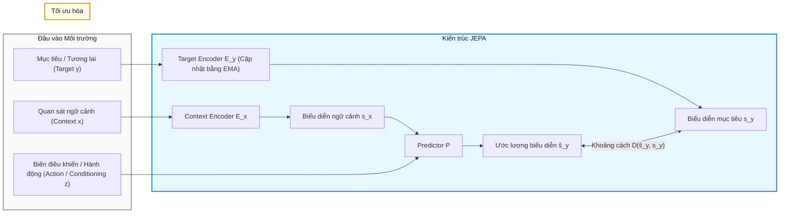
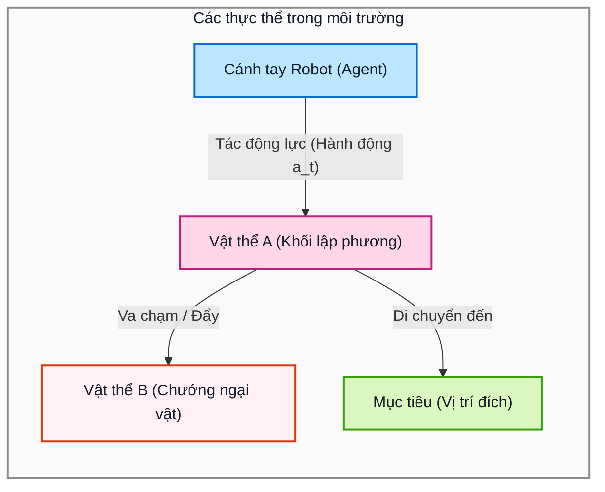
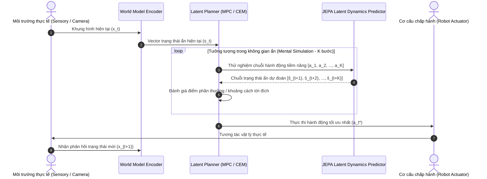

# Stanford CS25: Transformers United V6
## From Representation Learning to World Modeling

> **Nguồn bài giảng**: [YouTube - Stanford Online (CS25 V6)](https://www.youtube.com/watch?v=GBd7iuJkW08)  
> **Diễn giả**: Hazel Nam (Heejeong Nam) & Lucas Maes (Brown University)  
> **Khóa học**: Stanford CS25 (Transformers United V6)  
> **Chủ đề chính**: Chuyển dịch từ Tái tạo điểm ảnh sang Dự đoán trong không gian ẩn (JEPA), Mô hình thế giới (World Models) và Suy luận nhân quả theo đối tượng (Causal-JEPA, LeWorldModel).

---

## 📑 Mục lục
1. [Bối cảnh & Động lực: Vì sao cần World Model?](#1-bối-cảnh--động-lực-vì-sao-cần-world-model)
2. [So sánh: Tái tạo điểm ảnh vs. Dự đoán không gian ẩn](#2-so-sánh-tái-tạo-điểm-ảnh-vs-dự-đoán-không-gian-ẩn)
3. [Kiến trúc JEPA (Joint Embedding Predictive Architecture)](#3-kiến-trúc-jepa-joint-embedding-predictive-architecture)
4. [LeWorldModel: Huấn luyện World Model ổn định từ Pixels](#4-leworldmodel-huấn-luyện-world-model-ổn-định-từ-pixels)
5. [Causal-JEPA: Học quan hệ nhân quả qua Object-Level Masking](#5-causal-jepa-học-quan-hệ-nhân-quả-qua-object-level-masking)
6. [Ứng dụng trong Embodied AI & Latent Planning](#6-ứng-dụng-trong-embodied-ai--latent-planning)
7. [Tầm nhìn AGI: Vượt ra ngoài giới hạn của LLM](#7-tầm-nhìn-agi-vượt-ra-ngoài-giới-hạn-của-llm)

---

## 1. Bối cảnh & Động lực: Vì sao cần World Model?

Trong kỷ nguyên của Large Language Models (LLM), việc dự đoán token tiếp theo (*next-token prediction*) đã tạo nên những bước tiến khổng lồ về khả năng sinh ngôn ngữ và lập trình. Tuy nhiên, ngôn ngữ tự nhiên chỉ là một phép trừu tượng hóa bậc cao của con người, không phản ánh đầy đủ quy luật vật lý và động lực học của thế giới thực.

Để tiến tới **AGI (Artificial General Intelligence)** và **Embodied AI (Trí tuệ nhân tạo hiện thân / Robotics)**, hệ thống AI cần có một **Mô hình thế giới (World Model)** bên trong:
- Có khả năng hình dung trước hệ quả của các hành động trước khi thực hiện.
- Hiểu được các thực thể (objects), sự tương tác và quan hệ nhân quả (cause-and-effect).
- Không bị phụ thuộc vào các chi tiết ngẫu nhiên (irrelevant noise) của môi trường.

---

## 2. So sánh: Tái tạo điểm ảnh vs. Dự đoán không gian ẩn

Các phương pháp học biểu diễn thị giác truyền thống thường dựa trên việc **tái tạo điểm ảnh (Pixel Reconstruction)** như Masked Autoencoders (MAE), VAE, hay Diffusion Models. Điều này dẫn đến sự lãng phí tài nguyên khổng lồ cho những chi tiết không mang giá trị ngữ nghĩa (ví dụ: gợn sóng nước, tán lá rung trong gió, vân thảm).

Ngược lại, **Dự đoán không gian ẩn (Latent Prediction)** tập trung mã hóa thông tin thành vector biểu diễn ngữ nghĩa và dự đoán trạng thái tương lai ngay trong không gian ẩn này.

```mermaid
flowchart TD
    subgraph Pixel_Reconstruction ["1. Hướng tiếp cận Tái tạo Điểm ảnh (Generative / MAE / Diffusion)"]
        A1["Quan sát gốc x_t"] --> B1["Encoder"]
        B1 --> C1["Latent Code z_t"]
        C1 --> D1["Decoder / Generator"]
        D1 --> E1["Tái tạo điểm ảnh chi tiết x̂_{t+1}"]
        E1 -.->|"Lãng phí tài nguyên vào: vân gỗ, lá cây rung, nhiễu ngẫu nhiên"| F1["Pixel Loss (MSE / L1)"]
    end

    subgraph Latent_Prediction ["2. Hướng tiếp cận Dự đoán Không gian ẩn (JEPA / World Models)"]
        A2["Quan sát gốc x_t"] --> B2["Context Encoder"]
        B2 --> C2["Biểu diễn ngữ nghĩa s_t"]
        C2 --> D2["Latent Predictor (với hành động a_t)"]
        D2 --> E2["Dự đoán trạng thái ẩn ŝ_{t+1}"]
        
        A3["Quan sát kế tiếp x_{t+1}"] --> B3["Target Encoder (EMA)"]
        B3 --> C3["Biểu diễn thực tế s_{t+1}"]
        
        E2 <-->|"So khớp trong không gian ẩn (Latent Loss / Cosine / L1)"| C3
    end

    style Pixel_Reconstruction fill:#fff1f0,stroke:#cf1322,stroke-width:2px,color:#111827
    style Latent_Prediction fill:#f6ffed,stroke:#389e0d,stroke-width:2px,color:#111827
```

---

## 3. Kiến trúc JEPA (Joint Embedding Predictive Architecture)

Được khởi xướng bởi Yann LeCun, kiến trúc **JEPA** loại bỏ hoàn toàn tầng giải mã điểm ảnh (pixel decoder), thay vào đó tối ưu hóa việc dự đoán giữa các vector nhúng (embeddings).

* **Context Encoder ($E_x$)**: Mã hóa phần quan sát hiện tại đã biết.
* **Target Encoder ($E_y$)**: Mã hóa phần quan sát cần dự đoán (được cập nhật bằng trọng số trung bình trượt theo cấp số nhân - Exponential Moving Average - để tránh sụp đổ biểu diễn `representation collapse`).
* **Predictor ($P$)**: Dự đoán vector biểu diễn $s_y$ từ $s_x$ kết hợp với điều kiện hoặc hành động.

---

## 4. LeWorldModel: Huấn luyện World Model ổn định từ Pixels

Nghiên cứu của **Lucas Maes** giải quyết bài toán: *Làm thế nào để huấn luyện một World Model dựa trên JEPA trực tiếp từ các khung hình pixel mà không gặp hiện tượng suy biến biểu diễn hay mất ổn định số học.*

### Điểm nổi bật của LeWorldModel:
1. **End-to-End Latent Dynamics**: Học biểu diễn không gian và mô hình động lực học thời gian cùng lúc.
2. **Không cần Pixel Generation**: Cho phép mô hình chạy suy luận và tưởng tượng nhanh gấp nhiều lần so với các mô hình sinh video (như Sora hay Video Diffusion).
3. **Môi trường liên tục**: Thử nghiệm trên các môi trường vật lý phức tạp, chứng minh khả năng dự đoán quỹ đạo trạng thái trong không gian ẩn có độ tin cậy cao.

---

## 5. Causal-JEPA: Học quan hệ nhân quả qua Object-Level Masking

Nghiên cứu của **Hazel Nam** (*Causal-JEPA: Learning World Models through Object-Level Latent Masking*) mang lại một bước đột phá trong việc đưa **thiên kiến quy nạp về đối tượng và nhân quả (Object-centric & Causal inductive biases)** vào JEPA.

### Sự khác biệt trong chiến lược che phủ (Masking Strategy)

```mermaid
flowchart TD
    subgraph Patch_Masking ["Masking thông thường (MAE / I-JEPA)"]
        P1["Khung hình"] --> P2["Chia thành lưới ô vuông (Patches 16x16)"]
        P2 --> P3["Che ngẫu nhiên một số patch"]
        P3 --> P4["Mô hình học các quy luật thống kê cục bộ giữa các mảnh điểm ảnh"]
    end

    subgraph Object_Masking ["Object-Level Latent Masking (Causal-JEPA)"]
        O1["Khung hình"] --> O2["Phân rã thành các Thực thể / Vật thể (Object Slots / Entities)"]
        O2 --> O3["Che toàn bộ một Thực thể cụ thể (Object Masking)"]
        O3 --> O4["Dự đoán trạng thái của Thực thể bị che dựa trên tương tác với các Thực thể khác"]
        O4 --> O5["Học được Động lực học Nhân quả (Causal Relational Dynamics)"]
    end

    style Patch_Masking fill:#f9f0ff,stroke:#722ed1,stroke-width:2px,color:#111827
    style Object_Masking fill:#fcffe6,stroke:#7cb305,stroke-width:2px,color:#111827
```

### Đồ thị tương tác nhân quả giữa các thực thể (Object Causal Graph)

* Nhờ cơ chế Object Masking, **Causal-JEPA** buộc mô hình phải hiểu: Khi thực thể A thay đổi vị trí, thực thể B bị ảnh hưởng ra sao theo định luật bảo toàn và tương tác nhân quả.

---

## 6. Ứng dụng trong Embodied AI & Latent Planning

Khi ứng dụng vào hệ thống điều khiển Robot hoặc Agent tự hành, World Model hoạt động như một buồng giả lập bên trong não bộ (Mental Simulator), cho phép Agent lập kế hoạch theo thuật toán **Model Predictive Control (MPC)** trong không gian ẩn:

---

## 7. Tầm nhìn AGI: Vượt ra ngoài giới hạn của LLM

Bài seminar tại Stanford CS25 đi đến kết luận về định hướng tương lai của AI:

| Tiêu chí | LLM thuần túy (Next-Token) | World Models (JEPA / Causal-JEPA) |
| :--- | :--- | :--- |
| **Không gian biểu diễn** | Token văn bản rời rạc | Không gian vector ẩn liên tục (Latent Space) |
| **Cơ chế suy luận** | Tự hồi quy trên từ ngữ (*System 1*) | Mô phỏng và lập kế hoạch thử sai trong không gian ẩn (*System 2*) |
| **Hiểu thế giới vật lý** | Học gián tiếp qua mô tả văn bản | Học trực tiếp từ tương tác thị giác, không gian và động lực học |
| **Khả năng khái quát hóa** | Dễ ảo giác khi gặp cấu trúc vật lý mới | Khái quát hóa mạnh mẽ theo từng thực thể và quan hệ nhân quả |

---

## 📚 Tài liệu tham khảo
1. **Video Bài giảng**: [Stanford CS25 V6: From Representation Learning to World Modeling](https://www.youtube.com/watch?v=GBd7iuJkW08)
2. **Causal-JEPA Paper**: *Causal-JEPA: Learning World Models through Object-Level Latent Masking* (Hazel Nam et al.)
3. **LeWorldModel Project**: *Stable, End-to-End JEPA Training from Pixels* (Lucas Maes et al.)
4. **Trang chủ khóa học**: [Stanford CS25 - Transformers United](https://web.stanford.edu/class/cs25/)
